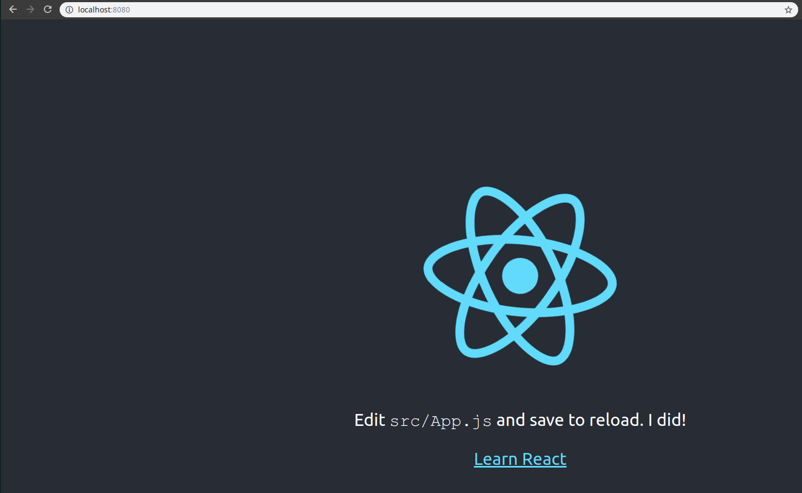

# Multistep docker builds

In development workflow we use the dev server, but in production we will not have it. So we'll need to setup an nginx server to serve the staticly generated files.
So we'll make another dockerfile for production mode.

The new production Dockerfile will have 2 phases:
1. Build phase
   1. Use node:alpine
   2. Copy the package.json
   3. Install dependencies
   4. Run `npm run build`
2. Run phase
   1. Use nginx
   2. Copy over the results of the `npm run build`
   3. Start nginx

These phases can be implemented by creating the Dockerfile

```
davis@davis-arch  ~/projects/docker/04_react_app   master  touch Dockerfile
```

With content:

```
FROM node:alpine AS builder
WORKDIR /app
COPY package.json .
RUN npm install
COPY . .
RUN npm run build

FROM nginx
COPY --from=builder /app/build /usr/share/nginx/html
```

Now when we build:

```
davis@davis-arch  ~/projects/docker/04_react_app   master  docker build .
Sending build context to Docker daemon  717.8kB
Step 1/8 : FROM node:alpine AS builder
 ---> ebbf98230a82
Step 2/8 : WORKDIR /app
 ---> Using cache
 ---> 93b2648262c0
Step 3/8 : COPY package.json .
 ---> Using cache
 ---> a33dd4926364
Step 4/8 : RUN npm install
 ---> Using cache
 ---> 2f4e0c88fbee
Step 5/8 : COPY . .
 ---> e9002362daaa
Step 6/8 : RUN npm run build
 ---> Running in 61cdb073c244

> frontend@0.1.0 build /app
> react-scripts build

Creating an optimized production build...
Compiled successfully.

File sizes after gzip:

  34.71 KB  build/static/js/1.fa92c112.chunk.js
  763 B     build/static/js/runtime~main.229c360f.js
  716 B     build/static/js/main.1cbe6fea.chunk.js
  510 B     build/static/css/main.00c0f591.chunk.css

The project was built assuming it is hosted at the server root.
You can control this with the homepage field in your package.json.
For example, add this to build it for GitHub Pages:

  "homepage" : "http://myname.github.io/myapp",

The build folder is ready to be deployed.
You may serve it with a static server:

  npm install -g serve
  serve -s build

Find out more about deployment here:

  http://bit.ly/CRA-deploy

Removing intermediate container 61cdb073c244
 ---> 1f0d8b362268
Step 7/8 : FROM nginx
latest: Pulling from library/nginx
5e6ec7f28fb7: Pull complete 
ab804f9bbcbe: Pull complete 
052b395f16bc: Pull complete 
Digest: sha256:56bcd35e8433343dbae0484ed5b740843dd8bff9479400990f251c13bbb94763
Status: Downloaded newer image for nginx:latest
 ---> 42b4762643dc
Step 8/8 : COPY --from=builder /app/build /usr/share/nginx/html
 ---> 1eb220e606fb
Successfully built 1eb220e606fb
```

And run it, visit with browser:

```
✘ davis@davis-arch  ~/projects/docker/04_react_app   master  docker run -p 8080:80 1eb220e606fb
172.17.0.1 - - [02/Feb/2019:11:34:01 +0000] "GET / HTTP/1.1" 200 2062 "-" "Mozilla/5.0 (X11; Linux x86_64) AppleWebKit/537.36 (KHTML, like Gecko) Chrome/71.0.3578.98 Safari/537.36" "-"
172.17.0.1 - - [02/Feb/2019:11:34:02 +0000] "GET /static/css/main.00c0f591.chunk.css HTTP/1.1" 200 984 "http://localhost:8080/" "Mozilla/5.0 (X11; Linux x86_64) AppleWebKit/537.36 (KHTML, like Gecko) Chrome/71.0.3578.98 Safari/537.36" "-"
172.17.0.1 - - [02/Feb/2019:11:34:02 +0000] "GET /static/js/1.fa92c112.chunk.js HTTP/1.1" 200 112436 "http://localhost:8080/" "Mozilla/5.0 (X11; Linux x86_64) AppleWebKit/537.36 (KHTML, like Gecko) Chrome/71.0.3578.98 Safari/537.36" "-"
172.17.0.1 - - [02/Feb/2019:11:34:02 +0000] "GET /static/js/main.1cbe6fea.chunk.js HTTP/1.1" 200 1349 "http://localhost:8080/" "Mozilla/5.0 (X11; Linux x86_64) AppleWebKit/537.36 (KHTML, like Gecko) Chrome/71.0.3578.98 Safari/537.36" "-"
172.17.0.1 - - [02/Feb/2019:11:34:02 +0000] "GET /static/media/logo.5d5d9eef.svg HTTP/1.1" 200 2671 "http://localhost:8080/" "Mozilla/5.0 (X11; Linux x86_64) AppleWebKit/537.36 (KHTML, like Gecko) Chrome/71.0.3578.98 Safari/537.36" "-"
172.17.0.1 - - [02/Feb/2019:11:34:02 +0000] "GET /manifest.json HTTP/1.1" 200 306 "http://localhost:8080/" "Mozilla/5.0 (X11; Linux x86_64) AppleWebKit/537.36 (KHTML, like Gecko) Chrome/71.0.3578.98 Safari/537.36" "-"
172.17.0.1 - - [02/Feb/2019:11:34:02 +0000] "GET /favicon.ico HTTP/1.1" 200 3870 "http://localhost:8080/" "Mozilla/5.0 (X11; Linux x86_64) AppleWebKit/537.36 (KHTML, like Gecko) Chrome/71.0.3578.98 Safari/537.36" "-"
```

