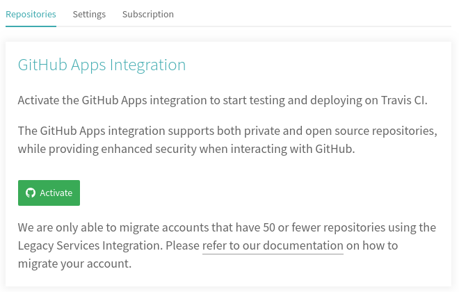
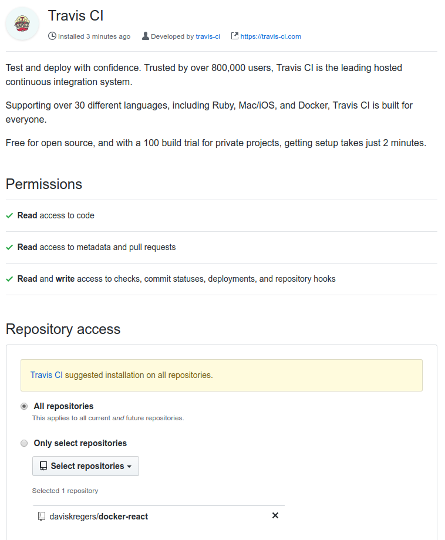
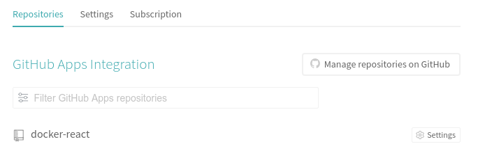
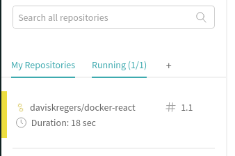
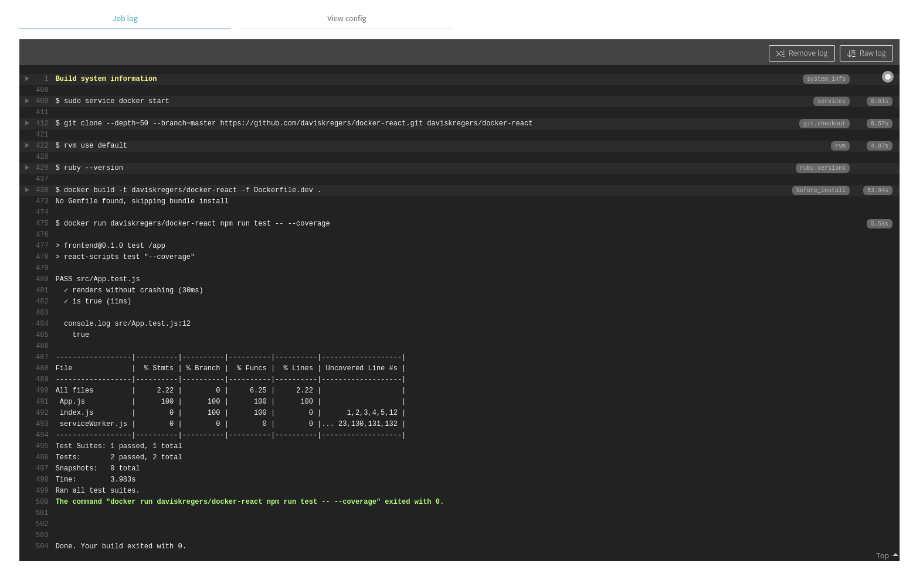

# Travis CI integration

The idea of using Travis CI is that it watches whenever we push something onto our Github repository, then it pulls all the code and does some predefined tasks like testing, building and deployment.

To get started, we navigate to [https://travis-ci.com/](https://travis-ci.com/)  and create an account and activating Github Apps integration.



When using creating the app, we select to use the repository we just made:



And now when refreshing the "Settings" section, we will see an option to manage the settings of the repository we want to watch.



## Travis YML FIle Configuration

Now we need to specify what exactly Travis needs to do with each push, for this we will create a `.travis.yml` file.

It will:

1. Tell travis we need a copy of docker running
2. Build our image using Dockerfile.dev
3. Tell Travis how to run our test suite
4. Tell travis to deploy our code to AWS

```yml
sudo: required
services:
  - docker
before_install:
  - docker build -t daviskregers/docker-react -f Dockerfile.dev .
script:
  - docker run daviskregers/docker-react npm run test -- --coverage
```

Now when we push it to github, we can see that Travis CI automatically picked it up:



And in the build time, it executed all the tests and ran coverage:

