# Automatic deployment to AWS

Now, when we have created a travis configuration file and executed all the tests, we can deploy it to AWS.

In order to get started with AWS, we need to create an account at [https://portal.aws.amazon.com/billing/signup#/start](https://portal.aws.amazon.com/billing/signup#/start), it may require entering credit card even while applying for free tier isntances.

Once AWS account is set up, we will create an "Elastic Beanstalk"  application. To do that, we can go to "Elastic Beanstalk" section and click on "Create New Application".

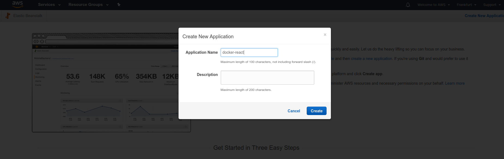
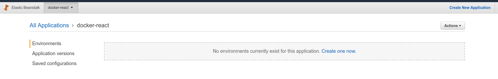

Now, we created a some kind of a workspace, where we'll need to create an environment.

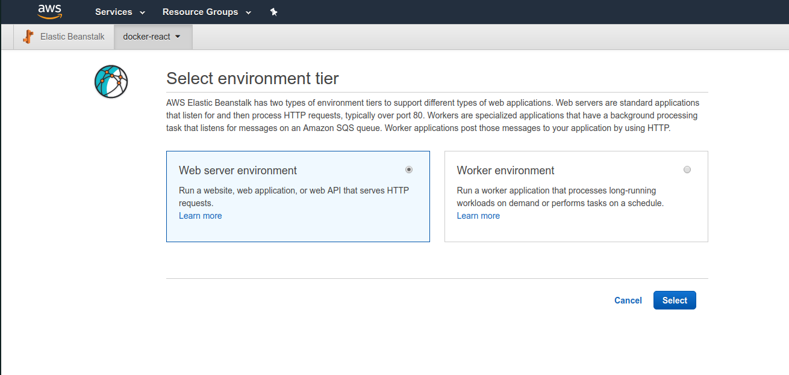

We will be asked to choose between a web server environment and worker environment. We are intending on running a web server environment.

On the next step we can leave everything as is except for the "Platform" - select "Docker" under it:

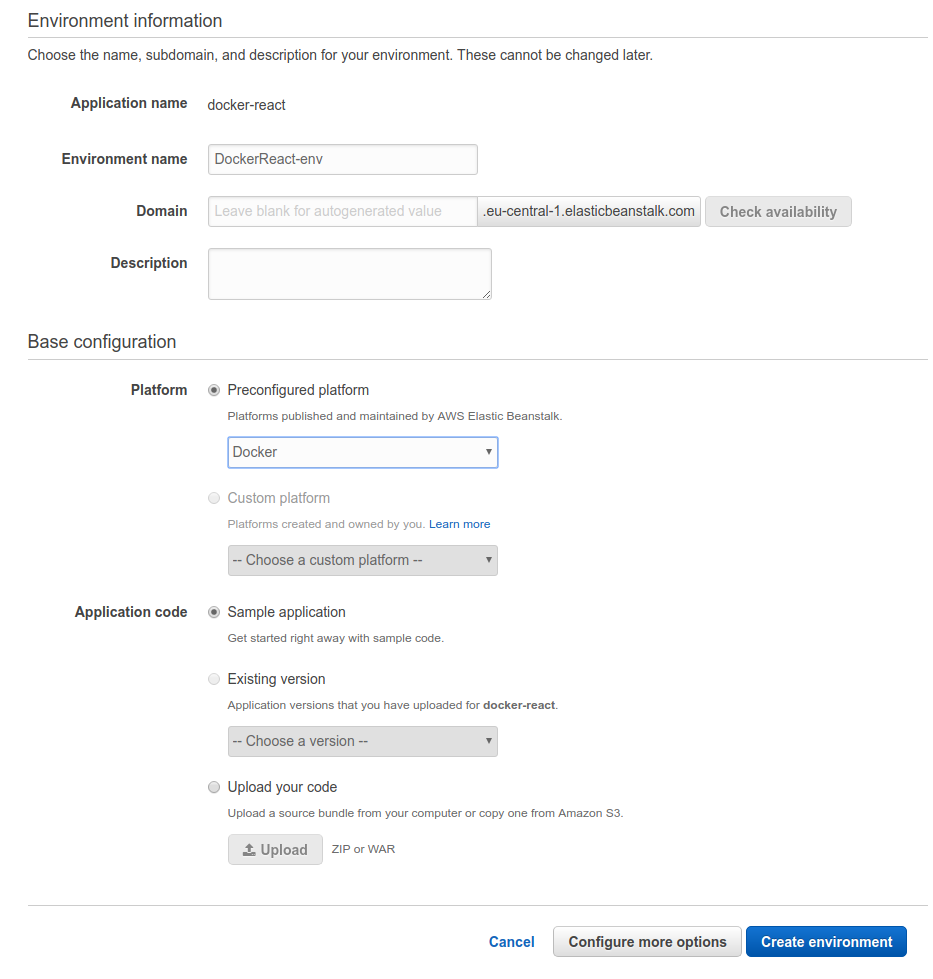

Now it will take some time to create the environment:

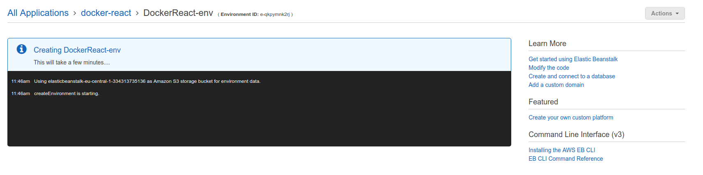

Once it's done, you'll see something like this:

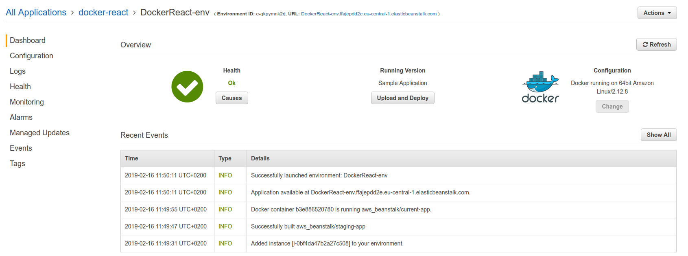

When opening up the link that beanstalk has provided, you can see the sample page:

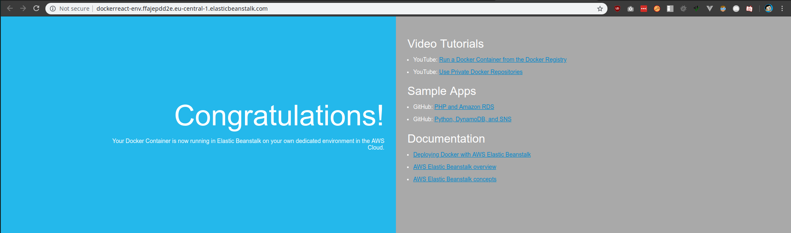

And under health section, you can see that there is one instance running behind the load balancer:

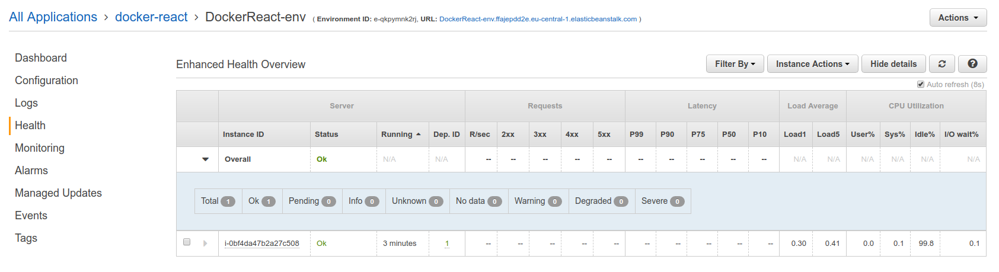

## Configuring Travis to deploy to AWS

Now we'll modify the travis configuration file to deploy to this Beanstalk environment.

```yml
deploy:
  - provider: elasticbeanstalk
  - region: "eu-central-1"
  - app: "docker-react"
  - environment: "DockerReact-env"
```

The `region` can be gotten from the link that the AWS created, `app` is the application name we created, `environment` is the environment we created.

Now we need to specify an S3 bucket from where the deployment files are taken from. We can find it by going to the S3 section of AWS.

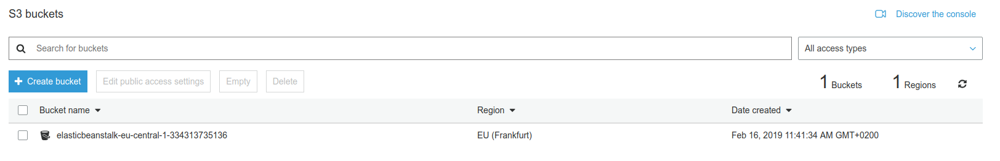

```yml
- bucket_name: "elasticbeanstalk-eu-central-1-334313735136"
- bucket_path: "docker-react"
```

So, now  the `.travis.yml` file looks like this:

```yml
sudo: required
services:
  - docker
before_install:
  - docker build -t daviskregers/docker-react -f Dockerfile.dev .
script:
  - docker run daviskregers/docker-react npm run test -- --coverage
deploy:
  - provider: elasticbeanstalk
  - region: "eu-central-1"
  - app: "docker-react"
  - environment: "DockerReact-env"
  - bucket_name: 
  - bucket_name: "elasticbeanstalk-eu-central-1-334313735136"
  - bucket_path: "docker-react"
  on:
    branch: master
```

In order to deploy this successfully we'll need access, to get it, we can go to `IAM -> Users` and create a new user:

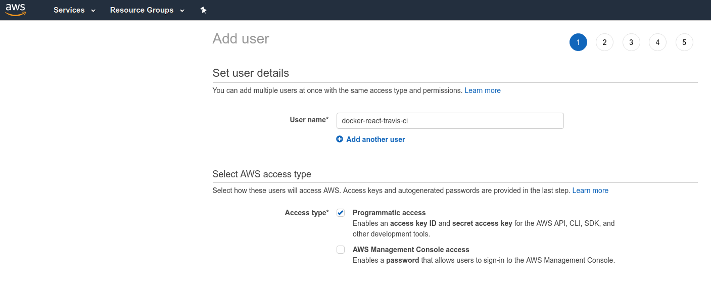

In the next permission step, we'll provide full access to AWS Elastic Beanstalk:

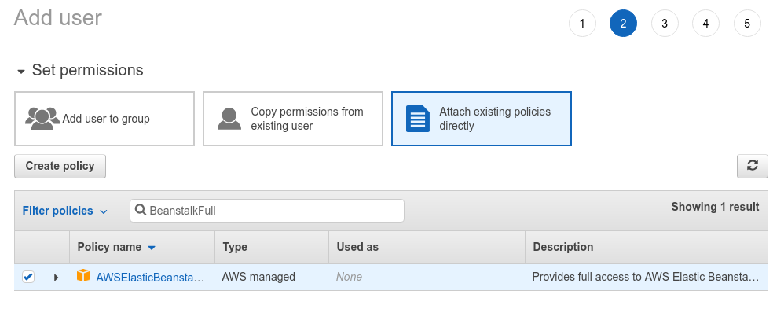

And once it's done, we'll get an access key and ID:

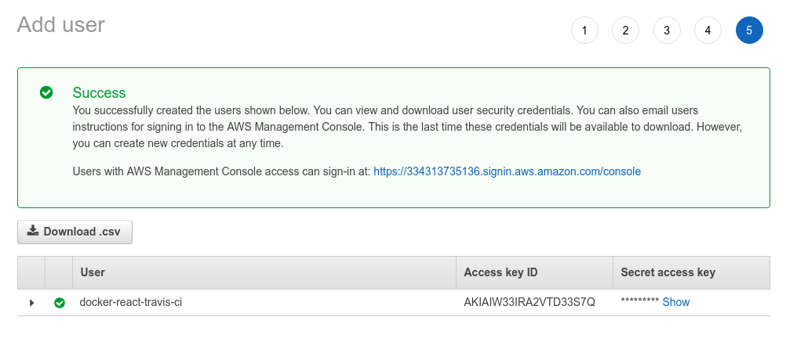

These keys are required for the Travis CI to deploy the code, but we do not want to add it to the .yml file because anyone who can read the file, will have full access to the elastic beanstalk instances.

We can overcome this by going to "More options -> settings" in Travis and there will be a section for Environment variable management.

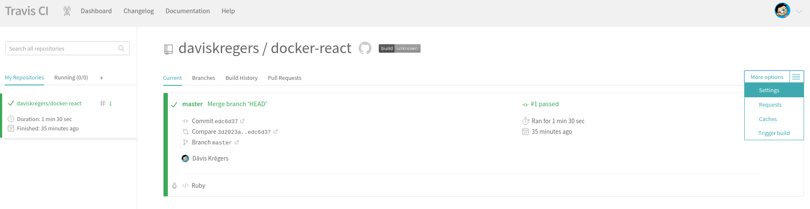

And we add both values like so:

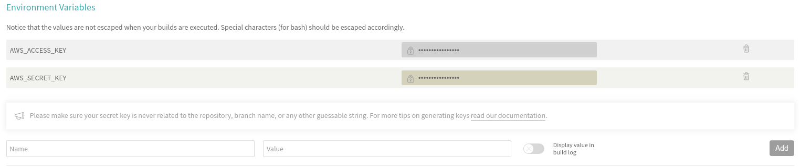

Now we'll tell the travis to use these environment variables:

```yml

sudo: required
services:
  - docker
before_install:
  - docker build -t daviskregers/docker-react -f Dockerfile.dev .
script:
  - docker run daviskregers/docker-react npm run test -- --coverage
deploy:
  - provider: elasticbeanstalk
  - region: "eu-central-1"
  - app: "docker-react"
  - environment: "DockerReact-env"
  - bucket_name: 
  - bucket_name: "elasticbeanstalk-eu-central-1-334313735136"
  - bucket_path: "docker-react"
  on:
    branch: master
  access_key_id: $AWS_ACCESS_KEY
  secret_access_key:
    secure: "$AWS_SECRET_KEY"

```

Now when we push out travis configuration to github:

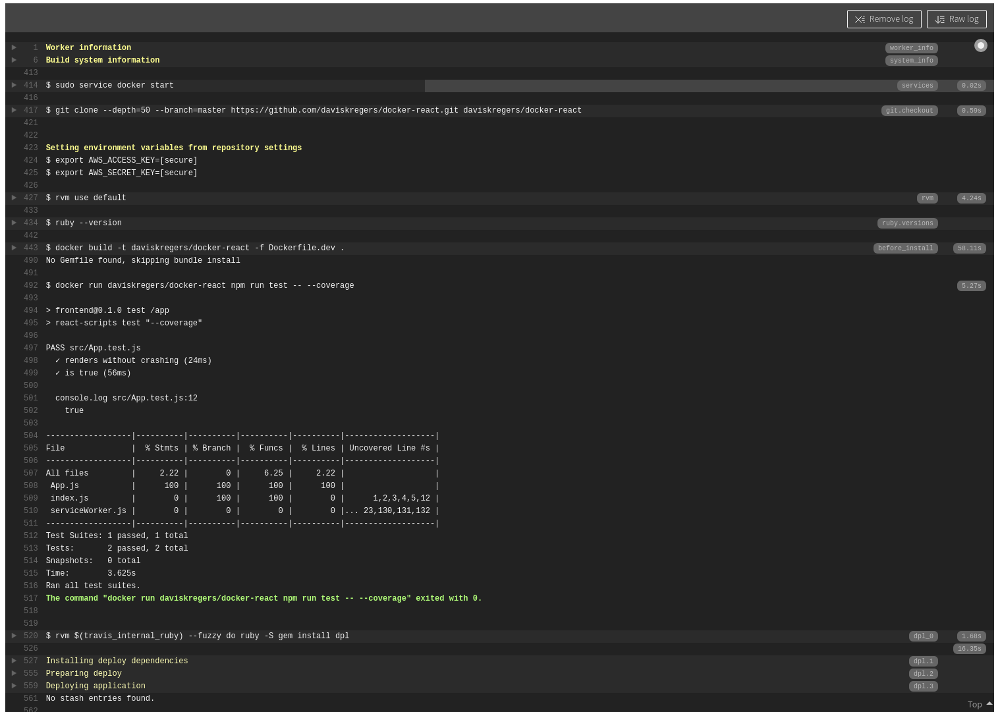
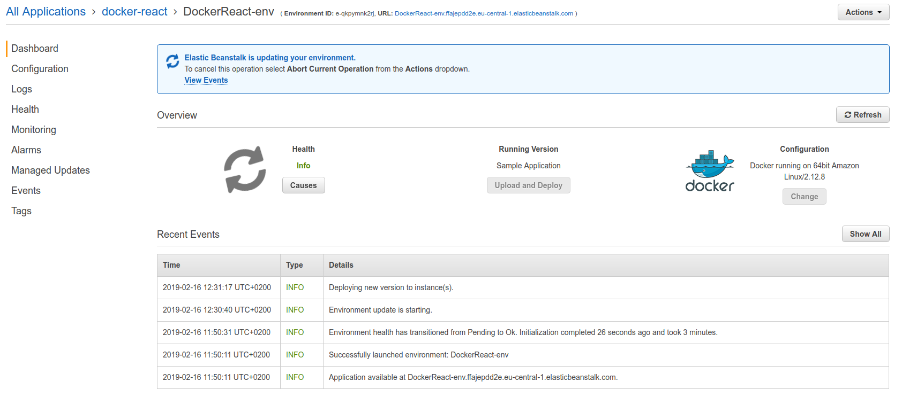

At the end the deployment will fail. Now we need to do one more thing in order to make everything work - open up the port 80 in the production dockerfile.

```Dockerfile

FROM node:alpine AS builder
WORKDIR /app
COPY package.json .
RUN npm install
COPY . .
RUN npm run build

EXPOSE 80

FROM nginx
COPY --from=builder /app/build /usr/share/nginx/html

```

And now when pushing and letting the travis to finish:

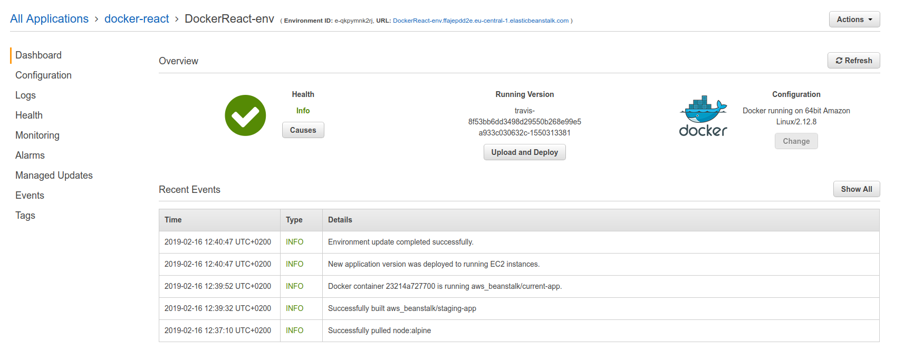

When opening the ELB url:

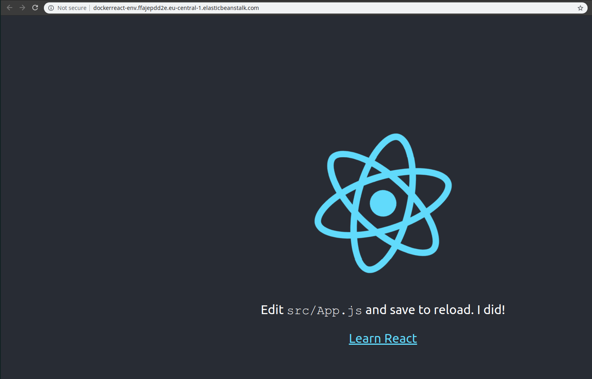