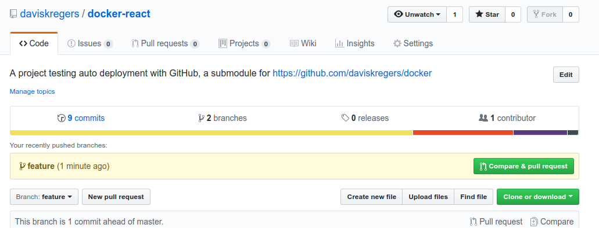
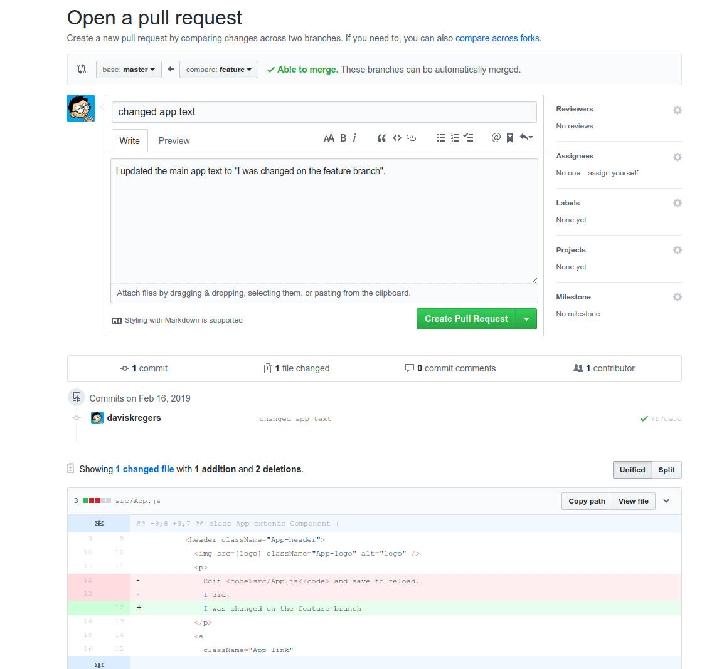
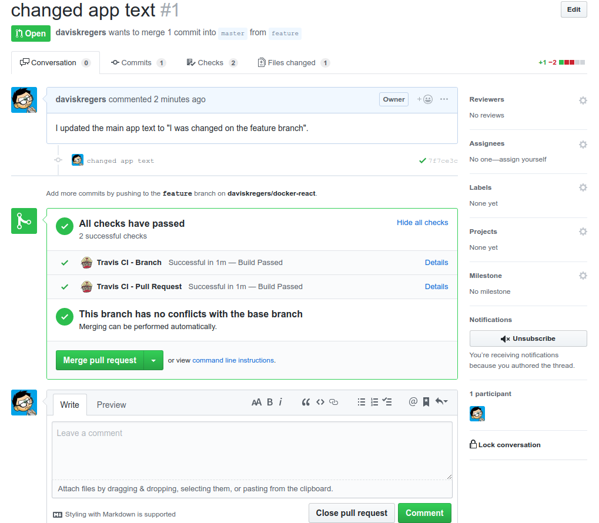
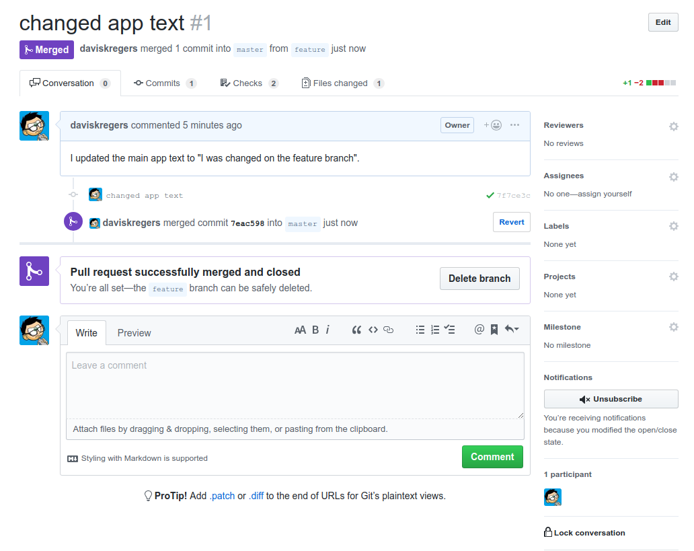
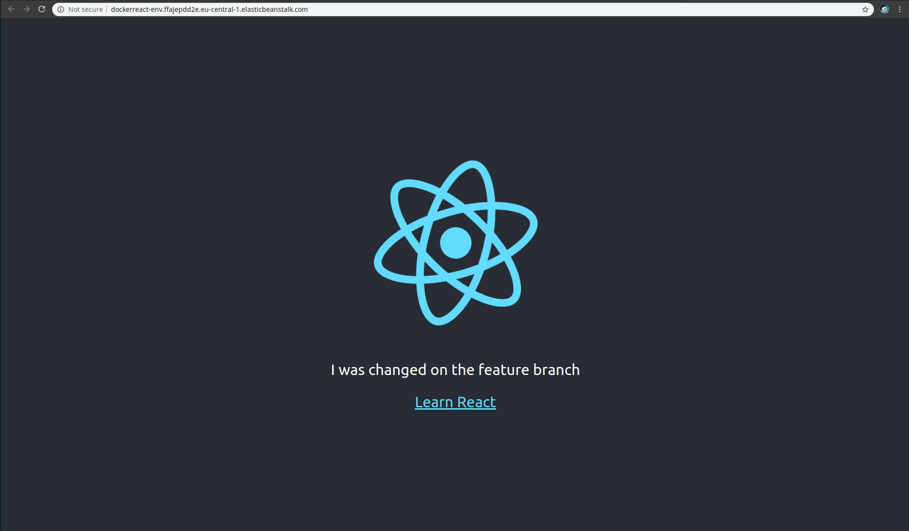

# Workflow with GitHub

In the service overview, we said that we will use feature branches for the development workflow.

```
davis@davis-arch  ~/projects/docker/05_aws_auto_deployment   master  git checkout -b feature
Switched to a new branch 'feature'
```

Now we'll make a change.

```
diff --git a/src/App.js b/src/App.js
index 4076e46..2a2814b 100755
--- a/src/App.js
+++ b/src/App.js
@@ -9,8 +9,7 @@ class App extends Component {
         <header className="App-header">
           
           <p>
-            Edit <code>src/App.js</code> and save to reload.
-            I did!
+            I was changed on the feature branch
           </p>
           <a
             className="App-link"
```

Push it:

```
davis@davis-arch  ~/projects/docker/05_aws_auto_deployment   feature ●  git commit -am "changed app text"
[feature 7f7ce3c] changed app text
 1 file changed, 1 insertion(+), 2 deletions(-)
 davis@davis-arch  ~/projects/docker/05_aws_auto_deployment   feature  git push origin feature
Enumerating objects: 7, done.
Counting objects: 100% (7/7), done.
Delta compression using up to 8 threads
Compressing objects: 100% (4/4), done.
Writing objects: 100% (4/4), 400 bytes | 400.00 KiB/s, done.
Total 4 (delta 3), reused 0 (delta 0)
remote: Resolving deltas: 100% (3/3), completed with 3 local objects.
remote: 
remote: Create a pull request for 'feature' on GitHub by visiting:
remote:      https://github.com/daviskregers/docker-react/pull/new/feature
remote: 
To github.com:daviskregers/docker-react.git
 * [new branch]      feature -> feature
```

Now, when visiting the repository on github, we'll see a popup like this:



Once clicking on this putton, we'll attempt to merge it into the `master` branch:



It will automatically do checks whether the changes can be merged into the master,  travis will check whether it can build the project, but will not deploy it yet.



Now we can click on the green button to confirm the merge:



Now the Travis will automatically deploy the merged code to AWS:

