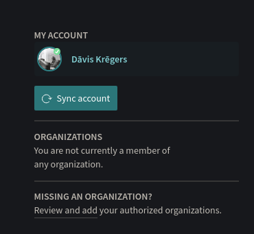
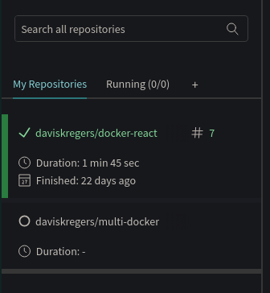

# Github and travis CI

Now we push the project to the GitHub. In order to do so, we will create a new repository at github called `multi-docker` and run following commands:

```bash
cd ~/projects/learning/docker_06/building_a_multicontainer_application
git init
git add .
git commit -m "first commit"
git remote add origin git@github.com:daviskregers/multi-docker.git
git push -u origin master
```

Now that the project has been pushed to GitHub, we will go to TravisCI. Because the repository is freshly created, we'll press the `Sync account` button in the `Settings` section of TravisCI.



Not you should see it in `GitHub Apps Integration` section. If not, then check the `Manage repositories on GitHub` section.


We'll click on the `settings` for `multi-docker` , now it should be visible in the left side build watcher.

