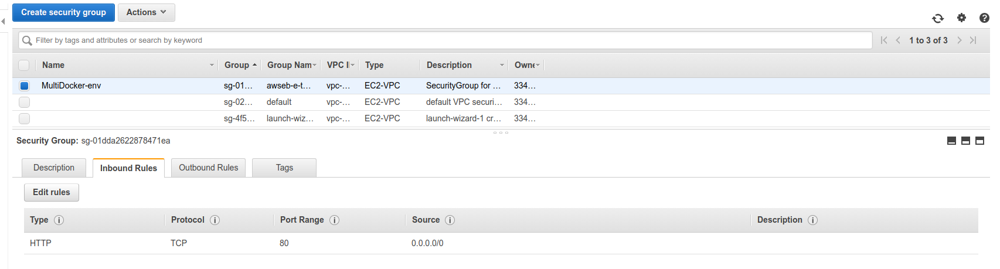

# Overview of AWS VPC's and Security Groups

We'll want to connect our EB instance with the `RDS (Postgres)` and `EC (Redis)` which by default is not allowed. 

The VPC stands for `Virtual Private Cloud` which is created for each account on each region, for example `eu-central-1`. This is done to isolate containers, they are accessible only to your account.

This VPC comes with set of security rules.

To view them, we can go to `Services -> VPC Dashboard -> VPCs`

We'll need to specify following security rules:
1. Allow any incoming traffic on port 80 from any IP
2. Allow any traffic from any other AWS service that has this security group

To set those up, we can go to `Services -> VPC Dashboard -> Security Groups` and there we should see a security group that is named same as our EB environment `MultiDocker-env`.

There, under the `Inbound Rules` we can see that we already allow incoming traffic on port 80 from any IP

