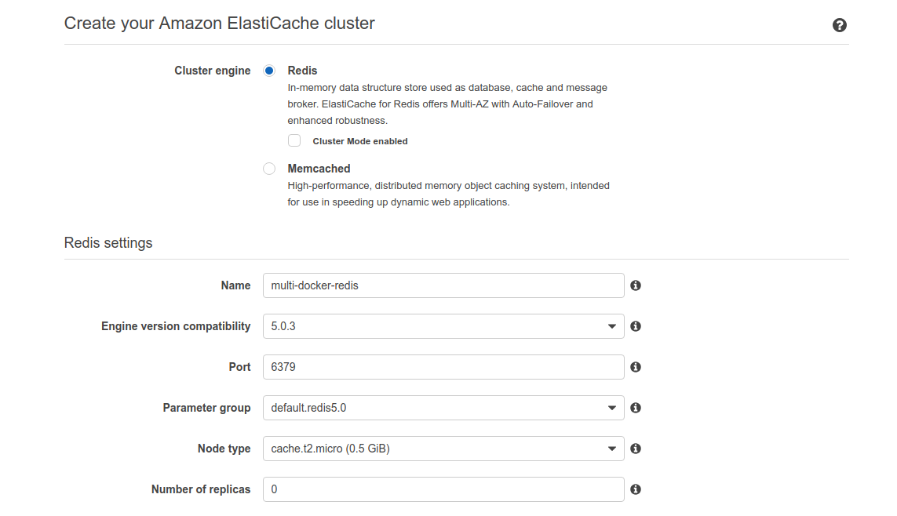
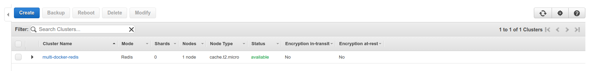

# Elasticache redis creation

To create `Elasticache Redis` we'll go to `Services -> Elasticache -> Redis` and click on `Create`.

We'll leave the `Cluster mode` disabled and set up the name and change the `note type` since the default one is quite expensive. Set `Number of Replicas` to 0.

Also, we'll make a `subnet` called `redis-group` and target it to the default VPC, check all the subnets.

Now the instance is creating:

After some time, it will change status as available:

