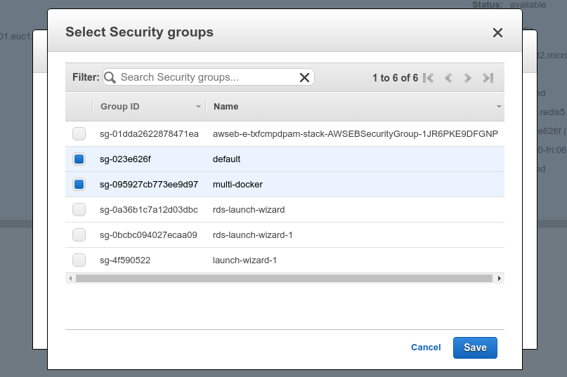
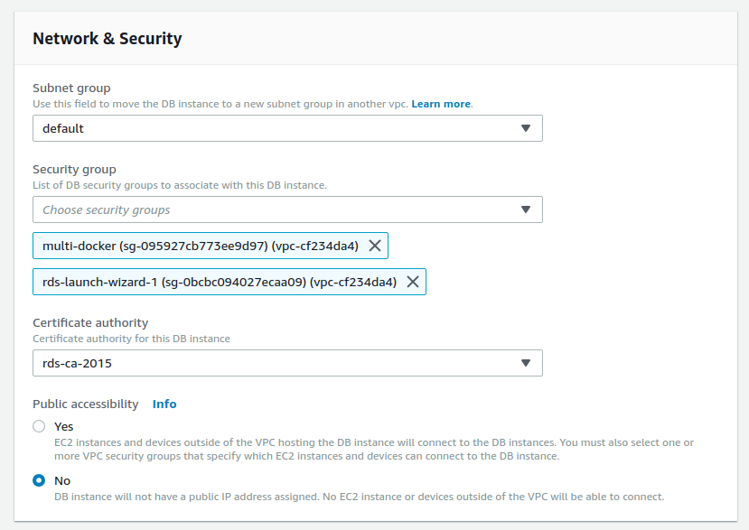
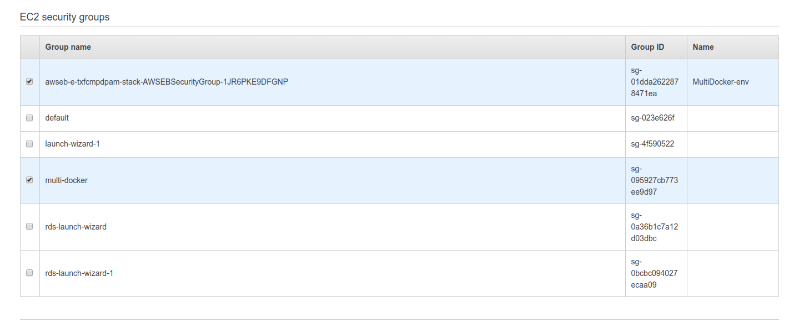

# Applying security groups to resources

Now, when we created a security group, we'll need to add the resources to this group.

## Elasticache Redis

First, we can go to `Services -> Elasticache -> Redis`, select our previously created instance and click on `modify`. Then we'll modify the `VPC security groups`:

And apply the changes.

# RDS Postgres

Go to `Services -> RDS`, check the created instance and click on `Modify`.
Under the `Network & Security` box, we can apply a security group:

# Elastic Beanstalk

Go to `Services -> Elastic Beanstalk -> Multidocker-env -> Configuration -> Instances -> EC2 security groups`

