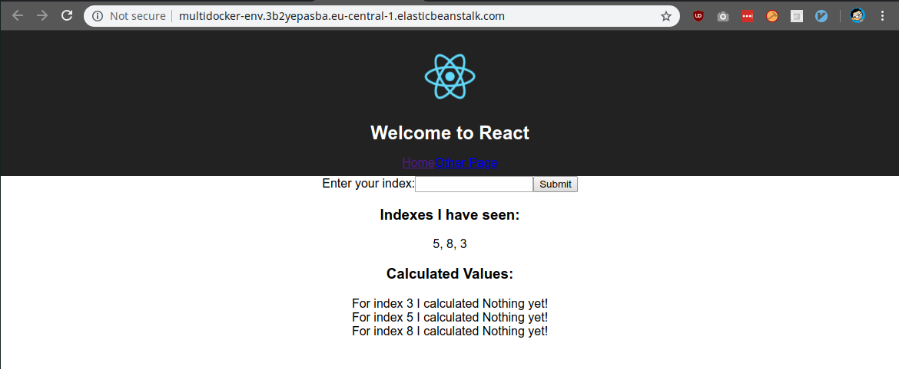

# Verify deployment

After memory allocation, there might be another error when deployment fails due to `docker push` creating a private repository. I made them public. 

Now, when deployed and opened up the aws url:

