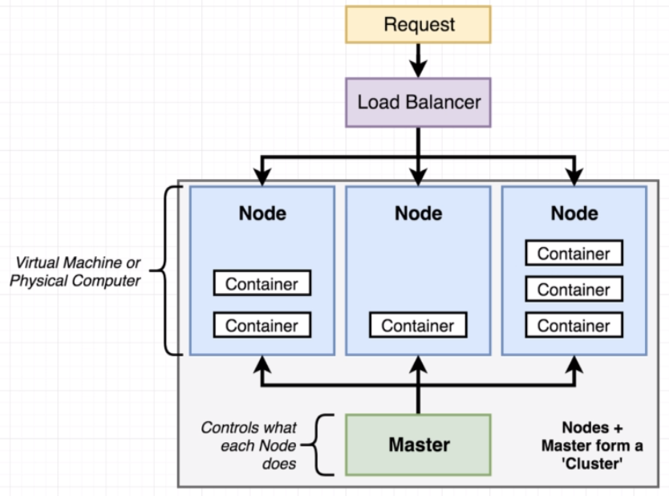

# What is Kubernetes

Previously we built an application with 4 containers running at the same time - nginx, server, client and a worker container.

But, if we would want it to scale using the AWS ELB, it would spawn new instances that runs all 4 of those containers  - doesn't matter that the actual load is only on one of those containers.
We can use kubernetes to solve this. 

Kubernetes creates a cluster that has one or multiple nodes (virtual or phisical machines) assigned to it. The master controls what each Node does. 
Each node runs a set of containers that master has told them to run.

## In summary

Kubernetes is a system for running many different containers over multiple different machines. 
You might want to use it when you need to run many different containers with different images.