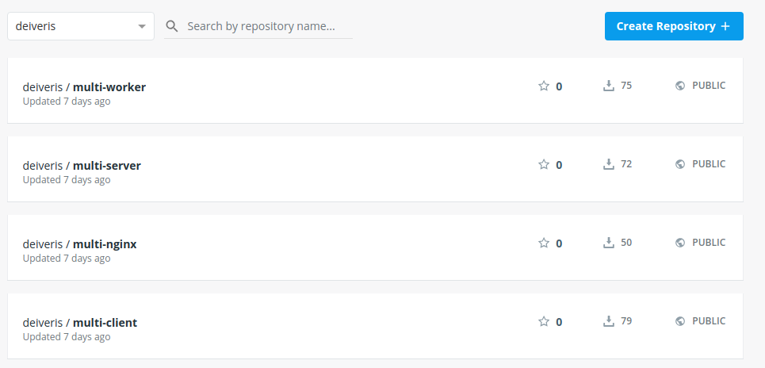

# Adding configuration files

Before starting to configuring, first we'll go to `https://hub.docker.com` and make sure that we still have our images there.



Now we'll create a new project:

```bash
davis@davis-arch  ~/projects/learning/docker   master  mkdir 07_simplek8s
davis@davis-arch  ~/projects/learning/docker   master  cd 07_simplek8s 
```

And make a new `client-pod.yaml` file:

```yaml
apiVersion: v1
kind: Pod
metadata:
  name: client-pod
  labels:
    component: web
spec:
  containers:
    - name: client
      image: deiveris/multi-client
      ports:
        - containerPort: 3000
```

And create `client-node-port.yaml`:

```yaml
apiVersion: v1
kind: Service
metadata:
    name: client-node-port
spec:
  type: NodePort
  ports:
    - port: 3050
      targetPort: 3000
      nodePort: 31515
  selector:
    component: web
```