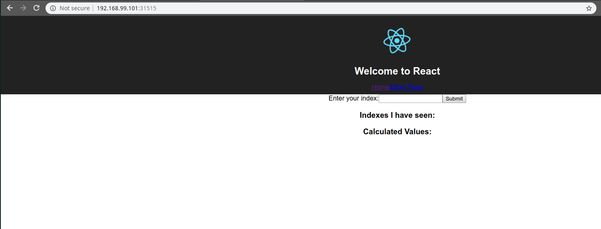

# Connecting to running containers

Now we are ready to load the configuration in our kubernetes cluster.

We can do that by doing

```bash
kubectl apply -f <filename>
```

```bash
$ ls
client-node-port.yaml  client-pod.yaml
$ kubectl apply -f client-pod.yaml
pod/client-pod created
$ kubectl apply -f client-node-port.yaml
service/client-node-port created
```

To check the status of the object:

```bash
kubectl get <object type>
```

```bash
$ kubectl get pods
NAME         READY   STATUS    RESTARTS   AGE
client-pod   1/1     Running   0          2m51s
```

```bash
$ kubectl get services
NAME               TYPE        CLUSTER-IP       EXTERNAL-IP   PORT(S)          AGE
client-node-port   NodePort    10.106.105.100   <none>        3050:31515/TCP   2m26s
kubernetes         ClusterIP   10.96.0.1        <none>        443/TCP          49m
```

So, everything seems to be running. We can verify that we can load the site.

Note that the minikube VM has it's own IP and will not respond to `localhost`, so we can run a command:

```bash
$ minikube ip
192.168.99.101
```

And visit `http://192.168.99.101:31515/`

