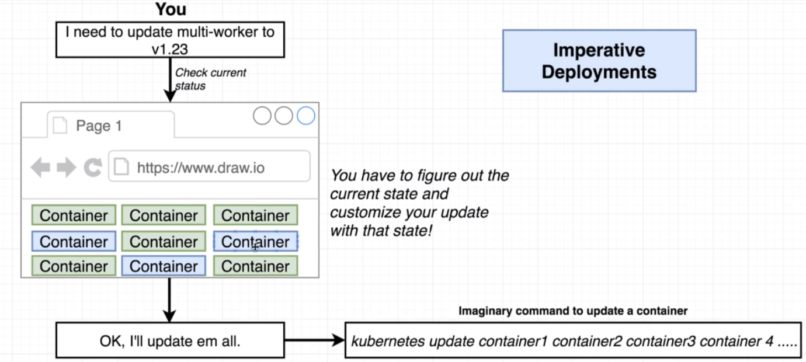
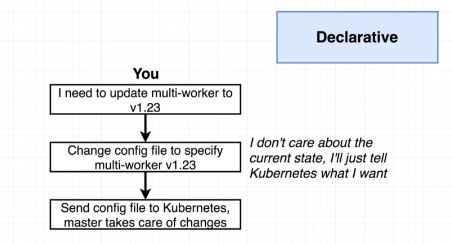

# Imperative vs declarative deployments

## Important takeaways

- Kubernetes is a system to deploy containerized apps
- `Nodes` are individual machines (or vm's) that run containers
- `Masters` are machines (or vm's) with a set of programs to manage the nodes
- Kubernetes didn't build our images - it got them from somewhere else
- Kubernetes (the master) decided where to run each container - each node can run a dissimilar set of containers. (we can specify on which node to run which containers, but by default the master decides itself).
- To deploy something, we update the desired state of the master with a config file
- The master works constantly to meet your desired state

## Imperative and Declaritive deployments

There are 2 ways to manage deployments:

- `Imperative` 
  - "Do exactly these steps to arrive at this container setup"
  - "Create this container, delete that one ..."
- `Declarative`
  - "Our container setup should look like this, make it hapen"

While kubernetes support both ways of doing things, for production environment it is recommended to use the `Declaritive` approach.