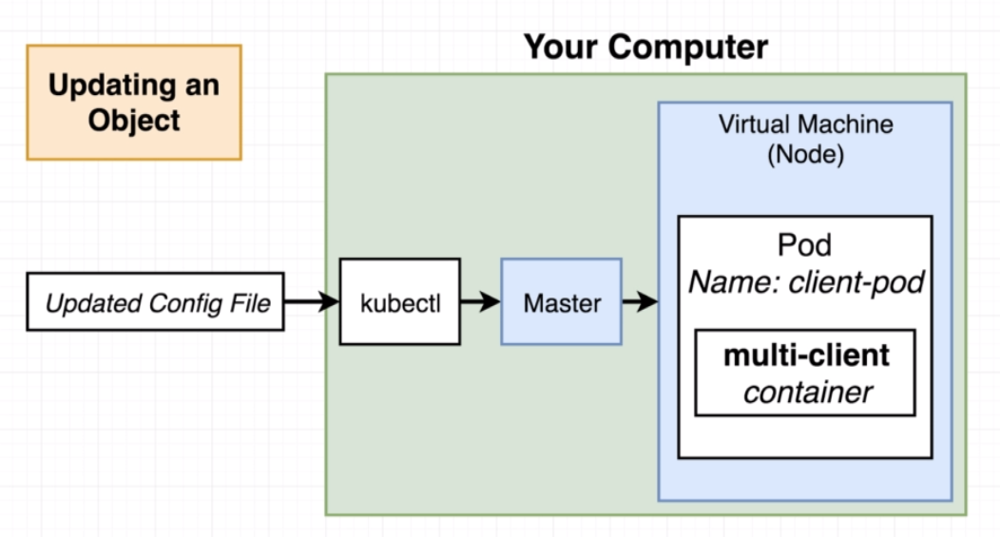

# Updating existing objects

## Goal

We'll update our existing `multi-client` pod to use the `multi-worker` image.

## Imperative approach

- Run a command to list our all current running pods
- Run a command to update the current pod to use a new image

## Declaritive approach

- Update our config file that orginally created the pod
- Throw the updated config file into kubectl

