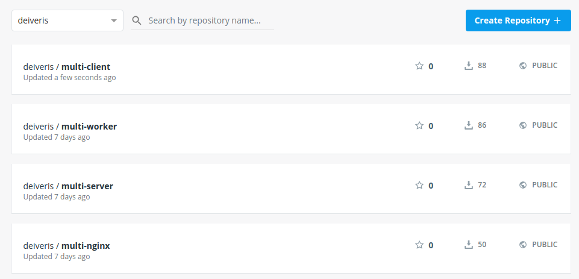

# Rebuilding the client image

Now as per mention in previous section, we are going to change and update the `multi-client` image, so we can push a new version on docker hub.

We'll open up `06_building_a_multicontainer_application/client/src/App.js` and modify it:

```js
import React, { Component } from 'react';
import logo from './logo.svg';
import './App.css';
import { BrowserRouter as Router, Route, Link } from 'react-router-dom';
import OtherPage from './OtherPage';
import Fib from './Fib';

class App extends Component {
  render() {
    return (
      <Router>
        <div className="App">
          <header className="App-header">
            
            <h1 className="App-title">Fib Calculator v2</h1>
            <Link to="/">Home</Link>
            <Link to="/otherpage">Other Page</Link>
          </header>
          <div>
            <Route exact path="/" component={Fib} />
            <Route path="/otherpage" component={OtherPage} />
          </div>
        </div>
      </Router>
    );
  }
}

export default App;
```

And we'll rebuild the image:

```
$ cd ../06_building_a_multicontainer_application/client
$ docker build -it deiveris/multi-client .
$ docker login
$ docker push deiveris/multi-client
```

And we can see that the image has been updated and pushed to `docker hub`:

