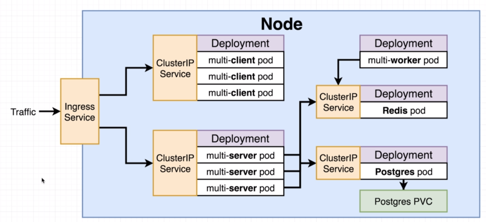

# The path to production

In this section we will take the previously created application and make it with use of kubernetes.

It will look like this:

First we will set all of this on local machine, then we will push it on a service provider like AWS or Google Cloud.

So, the steps we are going to take:
- Create config files for each service and deployment
- Test locally on minikube
- Create a Github/Travis flow to build images and deploy
- Deploy app to a cloud provider

