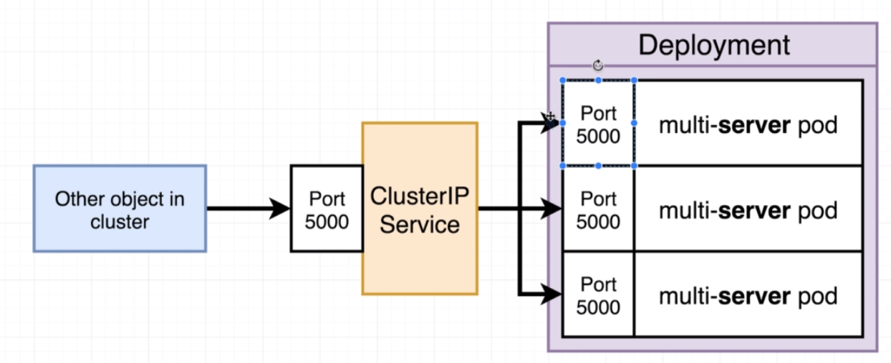

# Express API deployment config

Now we are going to add the deployment for the express API.

It should look like this:



So, like before, we create a `k8s/server-deployment.yaml` file:

```yaml
apiVersion: apps/v1
kind: Deployment
metadata:
  name: server-deployment
spec:
  replicas: 3
  selector:
    matchLabels:
      component: server
  template:
    metadata:
      labels:
        component: server
    spec:
      containers:
        - name: server
          image: deiveris/multi-server
          ports:
            - containerPort: 5000
```

Note that the image expects multiple environment variables to be specified, which will be looked at later.

