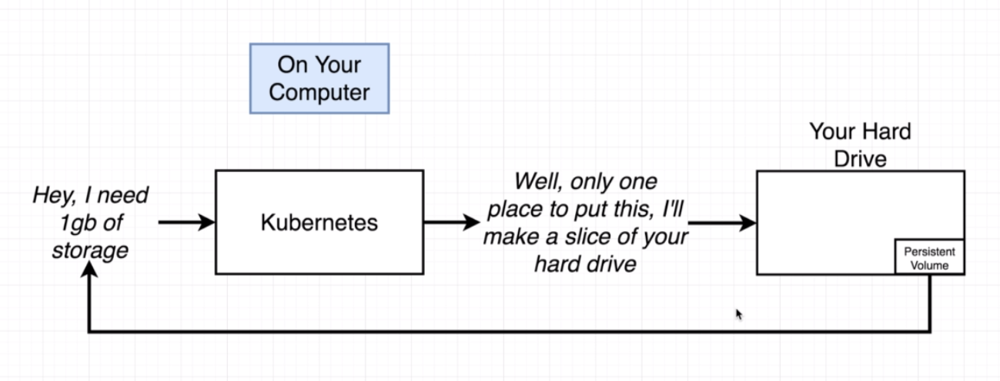
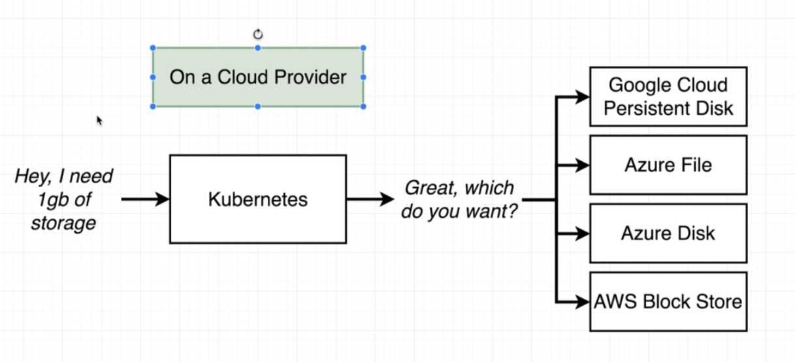

# Where does kubernetes allocate persistent volumes?



To get all the options for storage, we can see:

```
$ kubectl get storageclass
NAME                 PROVISIONER                AGE
standard (default)   k8s.io/minikube-hostpath   5h8m
```

```
$ kubectl describe storageclass
Name:                  standard
IsDefaultClass:        Yes
Annotations:           storageclass.beta.kubernetes.io/is-default-class=true
Provisioner:           k8s.io/minikube-hostpath
Parameters:            <none>
AllowVolumeExpansion:  <unset>
MountOptions:          <none>
ReclaimPolicy:         Delete
VolumeBindingMode:     Immediate
Events:                <none>
```

So, on our computer there is only one option - to store on hard drive.

But when we would host it on cloud, we  would get a large amount of options.



All the available storage classes are available here [https://kubernetes.io/docs/concepts/storage/storage-classes/](https://kubernetes.io/docs/concepts/storage/storage-classes/).