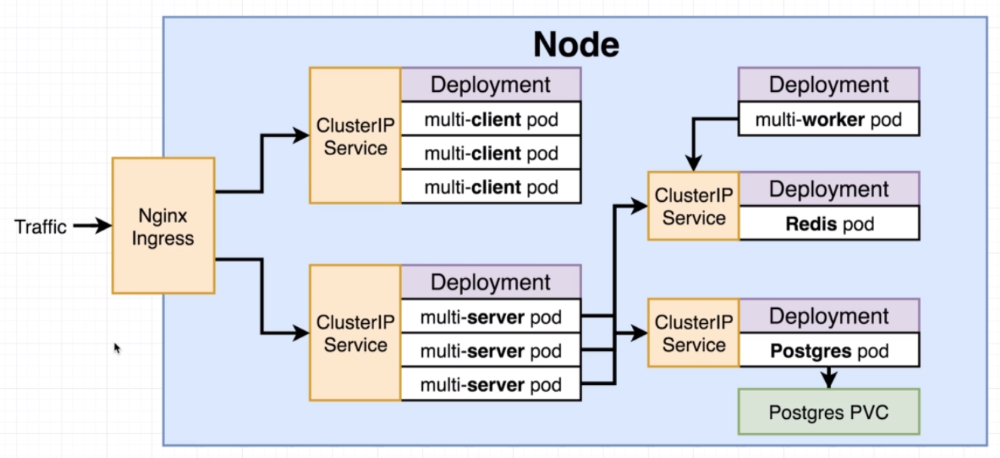

# A quck note on ingresses

In kubernetes there are several different implementations of ingress. We are going to use `ingress-nginx`.
Which is a community led project, not the official `kubernetes-ingress` which is a separate project that is also nginx based.

Setup of `ingress-nginx` changes depending on your environment (local, Google Cloud, AWS, Azure).
We are going to set up `ingress-nginx` on local and Google Cloud environments.

