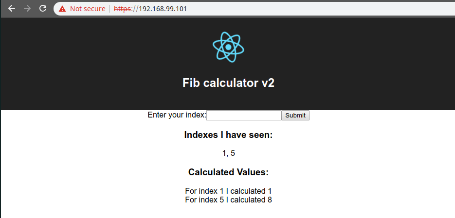

# Testing ingress locally

To test that everything is set up properlly, first we are going to get the IP of our cluster:

```
$ minikube ip
192.168.99.101
```

And now we can visit this IP directly:

```
https://192.168.99.101
```
The nginx will force https, which will appear not secure. Ignore the sertificate.
See that all the services are working as they should be:

