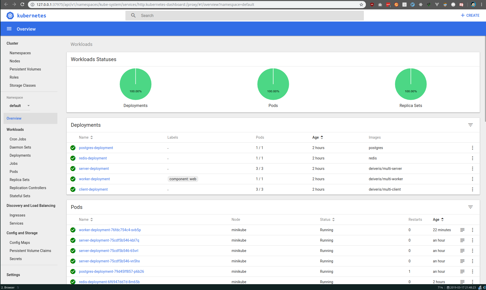

# The minikube dashboard

We can run this command:

```
$ minikube dashboard
-   Enabling dashboard ...
-   Verifying dashboard health ...
-   Launching proxy ...
-   Verifying proxy health ...
-   Opening http://127.0.0.1:37975/api/v1/namespaces/kube-system/services/http:kubernetes-dashboard:/proxy/ in your default browser...
[27329:27349:0317/214654.391943:ERROR:browser_process_sub_thread.cc(209)] Waited 4 ms for network service
Opening in existing browser session.
```

It will open up a dashboard that shows exactly what is going on in our cluster. 
We can also make changes but they will not be reflected to our configration files we made.

