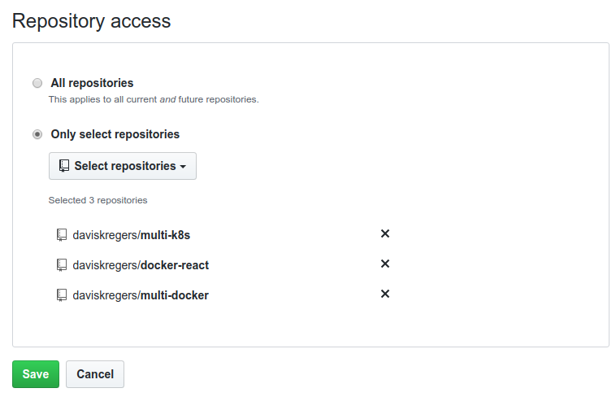
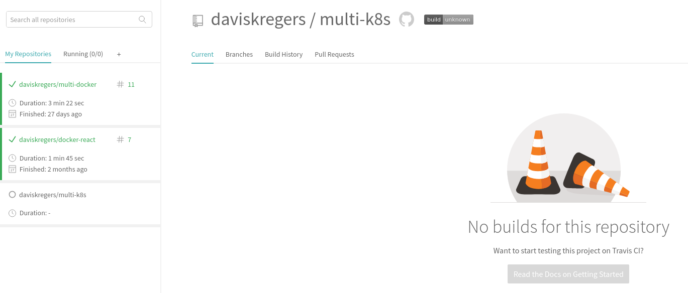

# Linking the Github Repo to Travis CI

Now that we have created the github repo and pushed the code to it, we can link travis CI to it.

We are going to [https://travis-ci.com/account/repositories](https://travis-ci.com/account/repositories)

First, we are going to push the `Sync account` button on the left side.

Then we are going to add the repo in `Manage repositories on Github`.

Click on `save` and then the `multi-k8s` building should be enabled. You can click on `Settings` to verify it.

