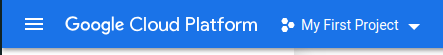
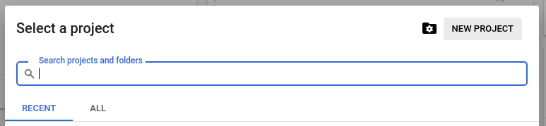

# Creating a Google Cloud project

In order to create the new project, we can navigate to [https://console.cloud.google.com](https://console.cloud.google.com).

On the top left corner, there is a project selector:

We are going to create a new project and call it `multi-k8s`.

