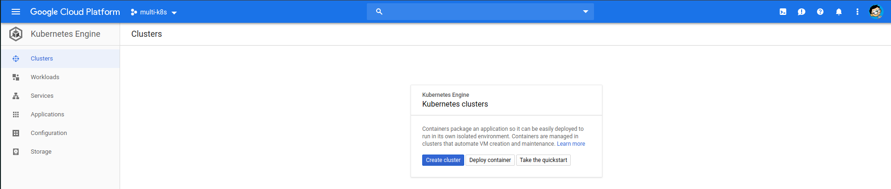
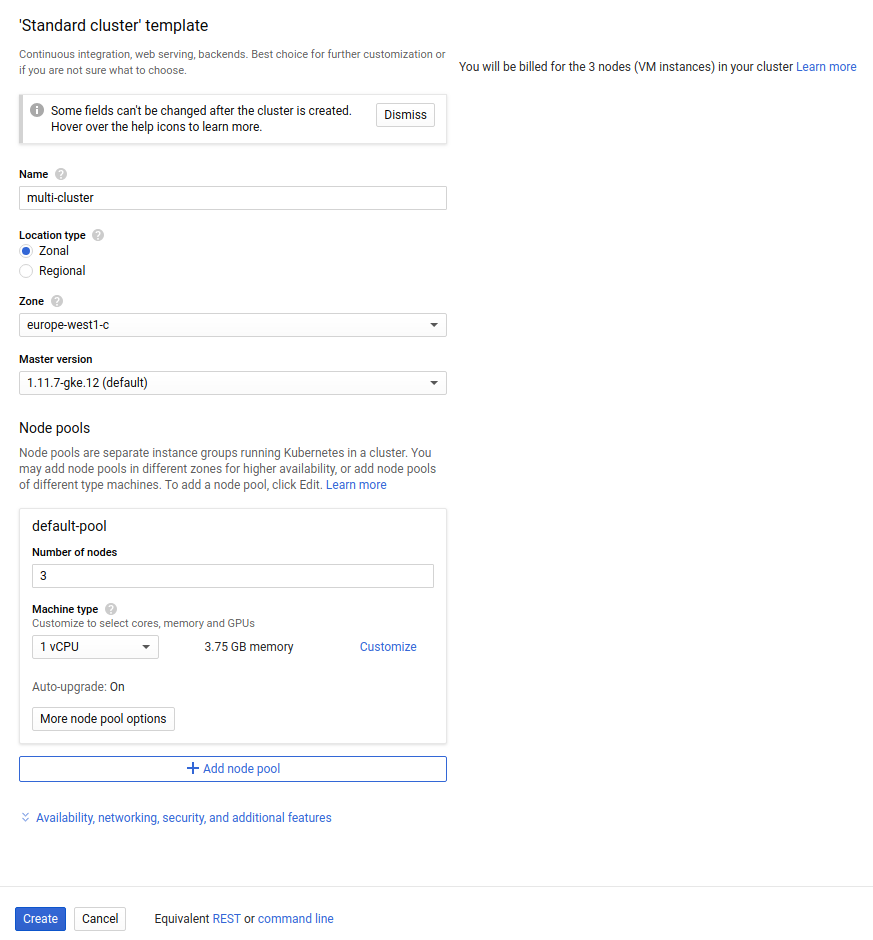
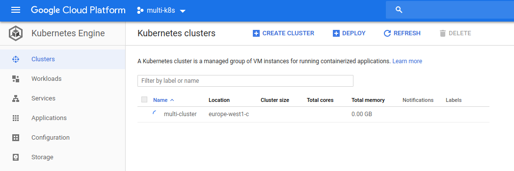

# Creating a cluster with Google Cloud

Now when the APIs have been initialized, we can create a new cluster:

We are going to click on the `Create cluster` button.

We are going to set the `name` as `multi-cluster`, set the location as `Zonal` and select whatever is closer to us. Leave the master version as the default setting.

For node pools we are going to select 3 `number of nodes`, `1 vCPU machine type`.

Now we are going to click on `Create`.

