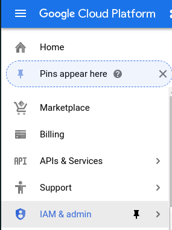
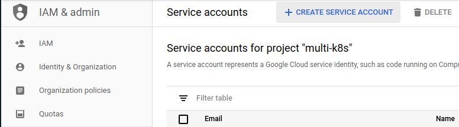
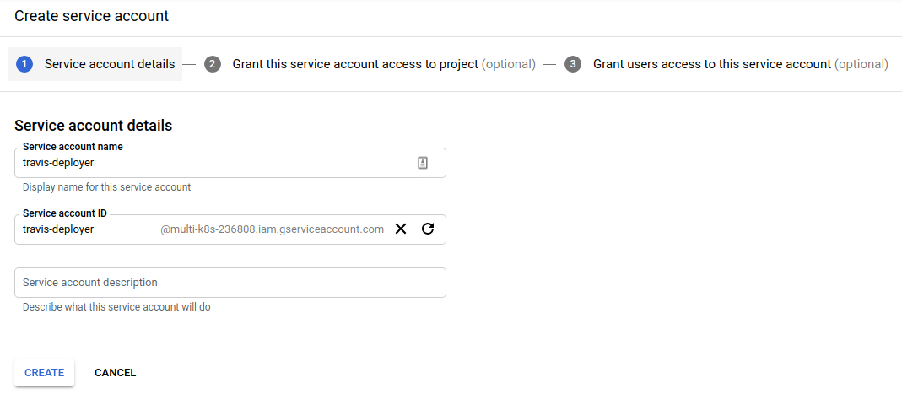
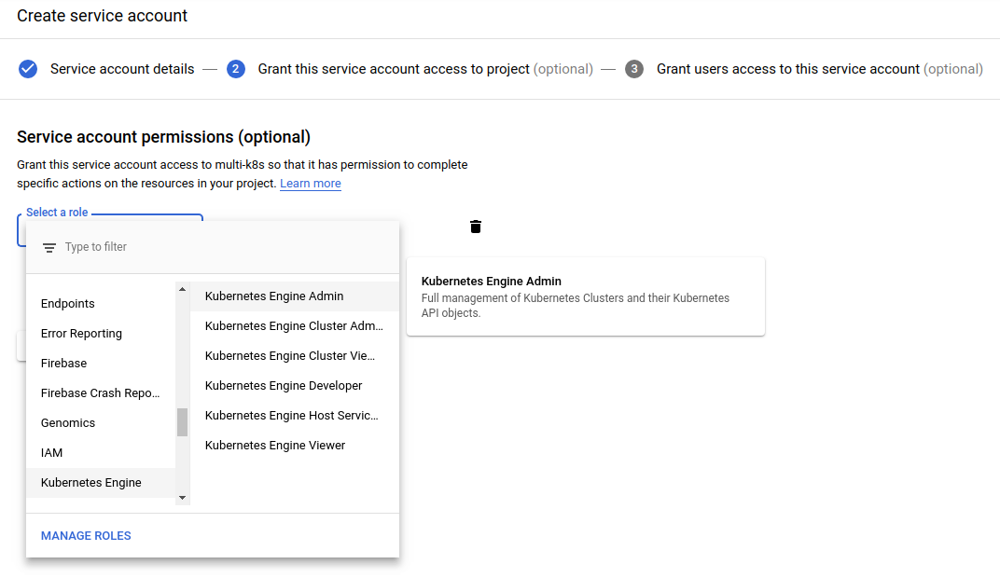
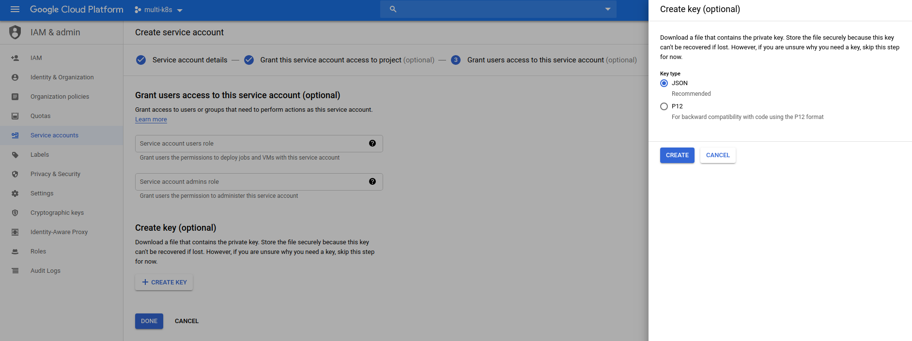
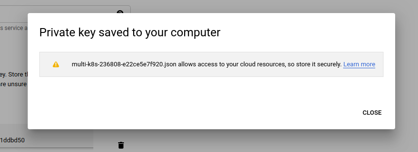

# Generating a service account

Now, when we have configuration on how to install google cloud and authorize in it, we need to create credentials for it to authorize with.

We are going to:

1. Create a Service account
2. Download service account credentials in a json file
3. Download and install Travis CLI
4. Encrypt and upload the json file to our travis account
5. In travis.yml, add code to unencrypt the json file and load into GCloud SDK

So, first, we are going to `IAM & admin` section in google cloud:

Then go to `Service accounts` and then click on `Create Service account`.

We are name the service account `travis-deployer`:

In the roles section, we are going to make it as a `Kubernetes Engine Admin`:

On the final step, we want to click on the `Create key` and select `JSON` type.

Once created, it will you to download it.

We can click on `Done` and see that the account has been created.