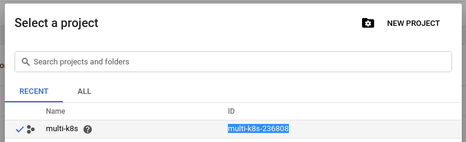
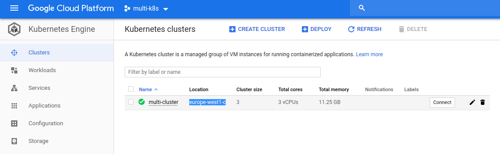

# More Google Cloud CLI Config

Previously we created an encrypted account service file that unencrypted, placed into the project directory and fed to Google Cloud CLI once it is installed on Travis CLI. 

Now we can set more configuration:

```yaml
sudo: required
services:
  - docker
before_install:
  - openssl aes-256-cbc -K $encrypted_0c35eebf403c_key -iv $encrypted_0c35eebf403c_iv -in service-account.json.enc -out service-account.json -d
  - curl https://sdk.cloud.google.com | bash > /dev/null;
  - source $HOME/google-cloud-sdk/path.bash.inc
  - gcloud components update kubectl
  - gcloud auth activate-service-account --key-file service-account.json
  - gcloud config set project multi-k8s-236808
  - gcloud config set compute/zone europe-west1-c
  - gcloud container clusters get-credentials multi-cluster
```

You can get the project ID from the project selector:



You can get the container name and zone from `Compute -> Kubernetes Engine -> Clusters`

