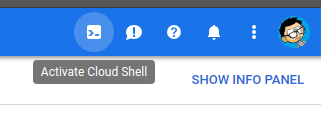
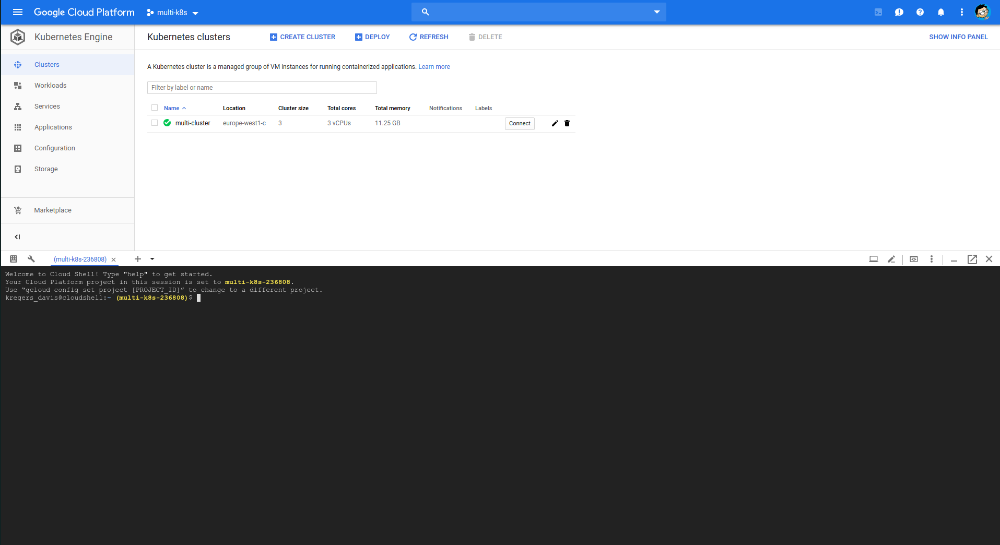

# Configuring GCloud CLI on Cloud Console

Before we push the project to travis and deploy it, we will need to set everything up on Google Cloud side, like `PGPASSWORD secret` which we previously [created locally](24_creating_an_encoded_secret.md)

We can run `Cloud Console` by clicking on this icon in `Google Cloud`.





Now we can run the commands:

```
gcloud config set project multi-k8s-236808
gcloud config set compute/zone europe-west1-c
gcloud container clusters get-credentials multi-cluster
```