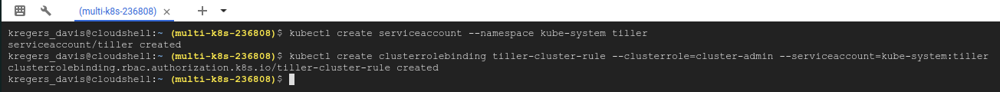
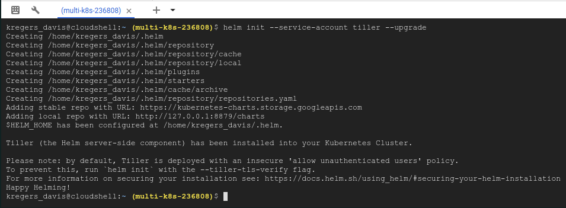

# Assigning Tiller a Service account

We can run the following commands in `Google Cloud Shell` to create a service account for `Tiller`. 

```
kubectl create serviceaccount --namespace kube-system tiller
kubectl create clusterrolebinding tiller-cluster-rule --clusterrole=cluster-admin --serviceaccount=kube-system:tiller
```



Now, we can finally run the helm init:

```
helm init --service-account tiller --upgrade
```



Now, finally, we have `Helm` installed.