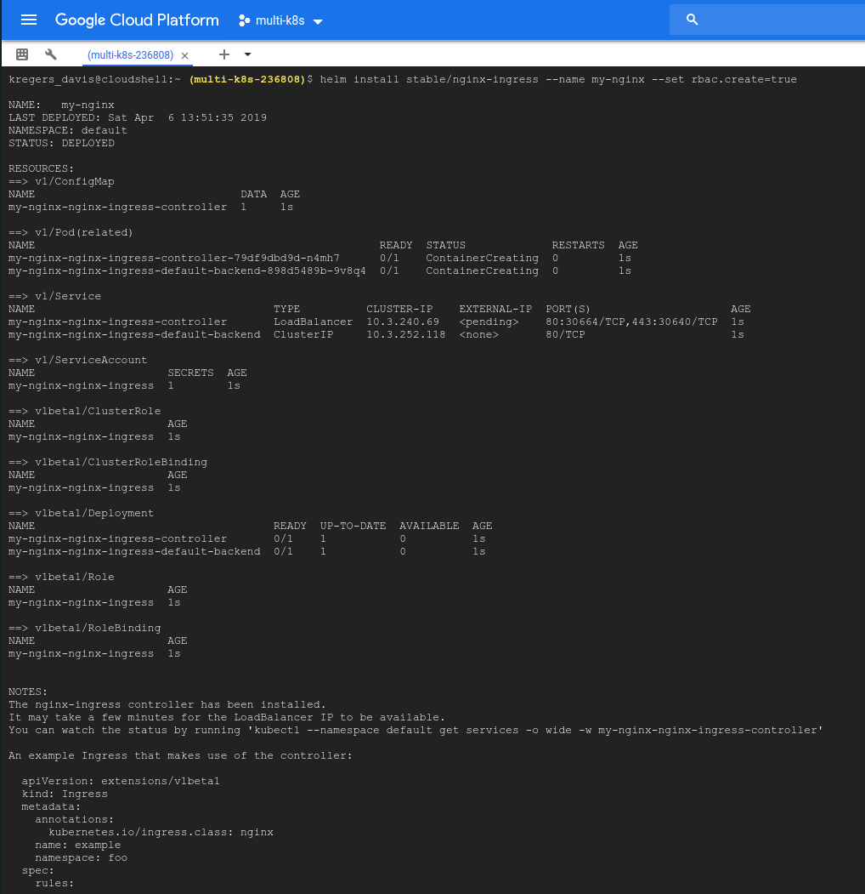

# Ingress-Nginx with Helm

Now we can install the `ingress-nginx` on Google Cloud by using Helm.
The commands for this are available at [https://kubernetes.github.io/ingress-nginx/deploy/#using-helm](https://kubernetes.github.io/ingress-nginx/deploy/#using-helm).

```
helm install stable/nginx-ingress --name my-nginx --set rbac.create=true
```

