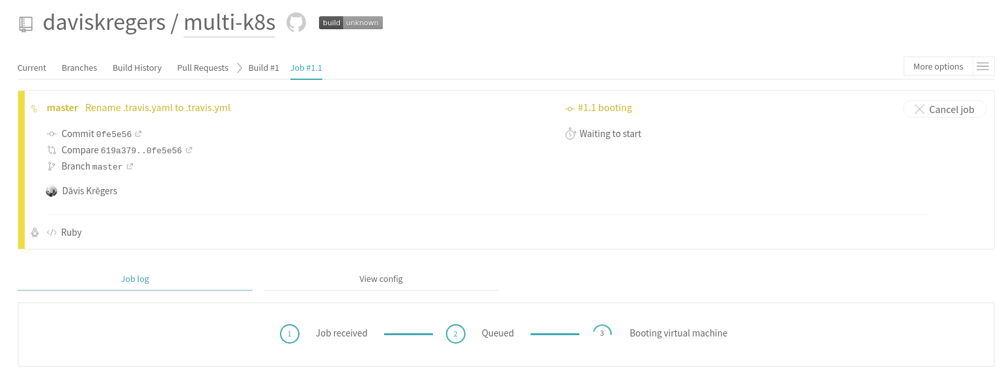
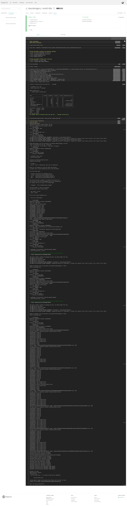
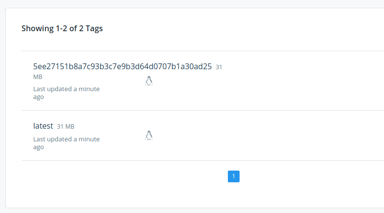
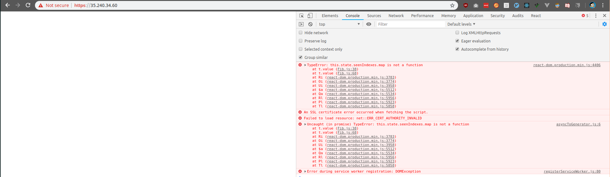
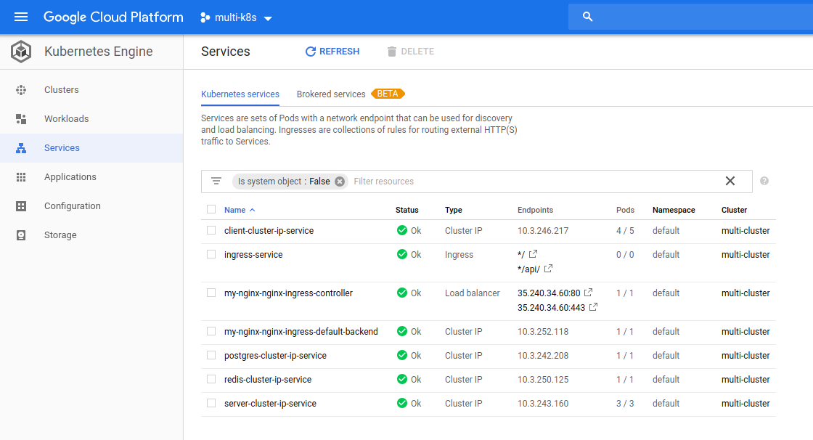
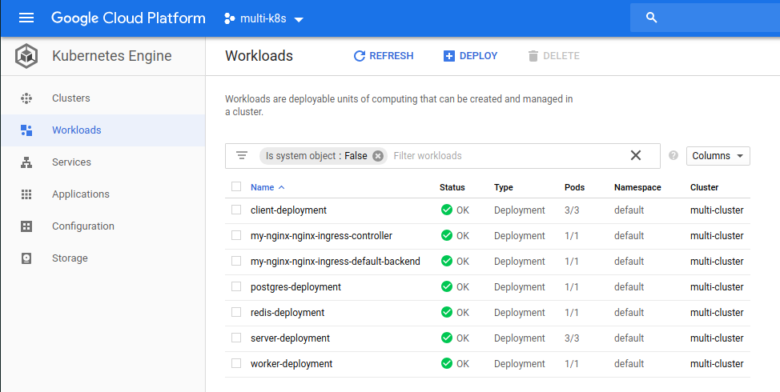

# Deployment

Now, we can go to the project and push the changes:

```
$ git status
On branch master
Your branch is ahead of 'origin/master' by 2 commits.
  (use "git push" to publish your local commits)

nothing to commit, working tree clean
$ git push origin master
Enumerating objects: 9, done.
Counting objects: 100% (9/9), done.
Delta compression using up to 8 threads
Compressing objects: 100% (8/8), done.
Writing objects: 100% (8/8), 3.83 KiB | 3.83 MiB/s, done.
Total 8 (delta 2), reused 0 (delta 0)
remote: Resolving deltas: 100% (2/2), done.
To github.com:daviskregers/multi-k8s.git
   acadafe..0f85f84  master -> master
```

Now the Travis CI has been started:



And after some time:



We can verify that the image was pushed to the Docker Hub:



It has pushed both the latest and the SHA tags to docker hub.

And if we visit the url of the `Load Balancer` at `https://35.240.34.60/`, we will see that the application has been deployed, but it does not work properly because of the unsigned certificate.



Also, under the `Kubernetes Engine` we can see the new `*/` and `*/api/` routes.



Also `Workloads` section:



And the `Persistent Storage` for postgres:

