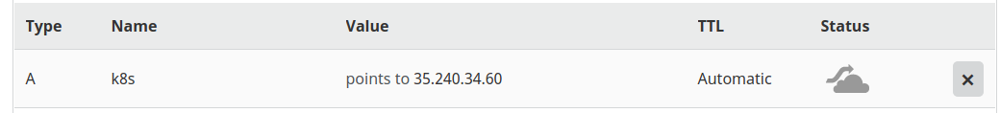

# Domain setup

Since I already have a domain at `deiveris.lv`, I will create a subdomain at `k8s.deiveris.lv`.
In domain settings, I am going to create an `A Record` that points to the `Load Balancer` in `Google Cloud`.

