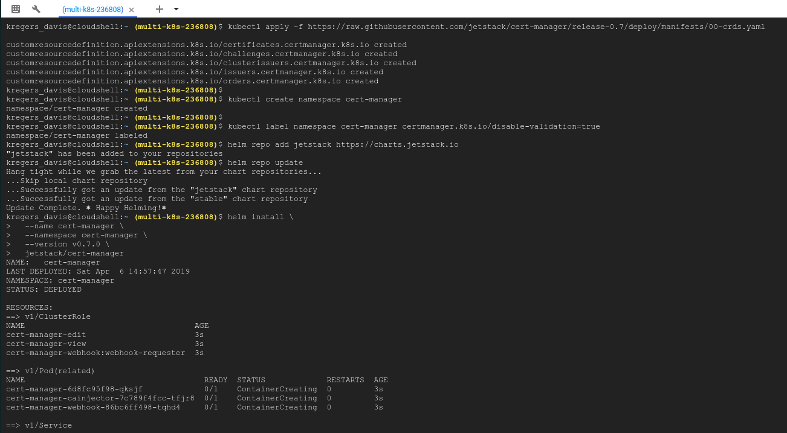
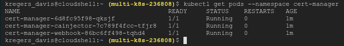

# Cert Manager installation

We are going to use `cert-manager` package to manage the certificates.
The documentation is available at [https://docs.cert-manager.io/en/latest/](https://docs.cert-manager.io/en/latest/).


We can install it by using `Helm`:
[https://docs.cert-manager.io/en/latest/getting-started/install.html#installing-with-helm](https://docs.cert-manager.io/en/latest/getting-started/install.html#installing-with-helm).

So, we'll run the command in our `Google Cloud Shell`.

```
# Install the CustomResourceDefinition resources separately
kubectl apply -f https://raw.githubusercontent.com/jetstack/cert-manager/release-0.7/deploy/manifests/00-crds.yaml

# Create the namespace for cert-manager
kubectl create namespace cert-manager

# Label the cert-manager namespace to disable resource validation
kubectl label namespace cert-manager certmanager.k8s.io/disable-validation=true

# Add the Jetstack Helm repository
helm repo add jetstack https://charts.jetstack.io

# Update your local Helm chart repository cache
helm repo update

# Install the cert-manager Helm chart
helm install \
  --name cert-manager \
  --namespace cert-manager \
  --version v0.7.0 \
  jetstack/cert-manager
```



Verify Installation:

