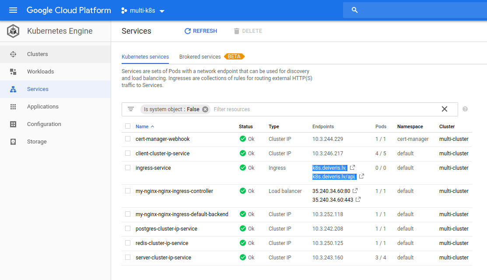
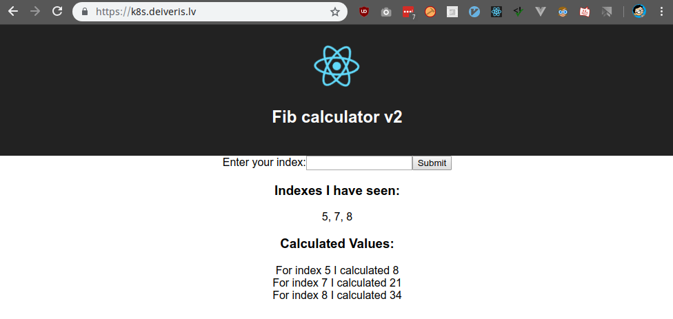

# Vertify changes

We are going to push it now:

```
$ git add .
$ git commit -m "ingress config fo certificate"
[master fac2595] ingress config for certificate
 1 file changed, 8 insertions(+), 1 deletion(-)
$ git push
Enumerating objects: 7, done.
Counting objects: 100% (7/7), done.
Delta compression using up to 8 threads
Compressing objects: 100% (4/4), done.
Writing objects: 100% (4/4), 523 bytes | 523.00 KiB/s, done.
Total 4 (delta 3), reused 0 (delta 0)
remote: Resolving deltas: 100% (3/3), completed with 3 local objects.
To github.com:daviskregers/multi-k8s.git
   56fb459..fac2595  master -> master
```

And wait for the Travis to apply changes.

After some time, we can see that the domain has been set.



When visiting the site, we can see that everything is working fine:

