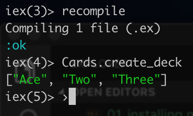

# Lists and strings

Now we create a method that generates a list of playing cards. The list can be defined by using `[]`. 

```elixir
def create_deck do
    ["Ace", "Two", "Three"]
end
```

The convention is to use double quotes `"` all though the code. Although using single quotes `'` is supported.

Now, when opening up the terminal again, if it was not closed - the `Cards.create_deck` will not be found, since the compiled version does not contain it.

In order to fix this, we can use the `recompile` command.

