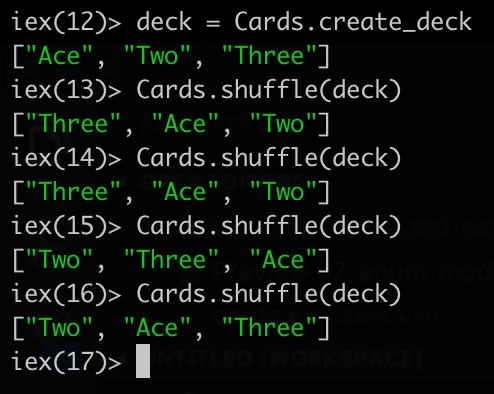

# The Enum mode

The previously created `shuffle` method will use the `elixir standard library`. For learning more on it, the documentation can be found at [https://elixir-lang.org/docs.html](https://elixir-lang.org/docs.html)

Specifically, it will use the `Enum` module [https://hexdocs.pm/elixir/Enum.html](https://hexdocs.pm/elixir/Enum.html), the shuffle method.

To call it, we can reference it as `Enum.shuffle()`.

```elixir
def shuffle(deck) do
    Enum.shuffle(dec)
end
```

And now, we can run it.

