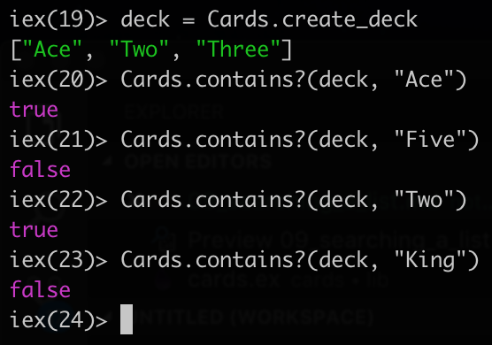

# Searching a list

The next method in the `Cards` module will be `contains?` method. That checks wether the list has a specific element, return either `true` or `false`.

By convention, whenever function has a question mark in it `?` it will return a `boolean` value.

To check whether a `card` is in the `deck` we can use the `Enum.member?` method.

```elixir
def contains?(deck, card) do
    Enum.member?(deck, card)
end
```

