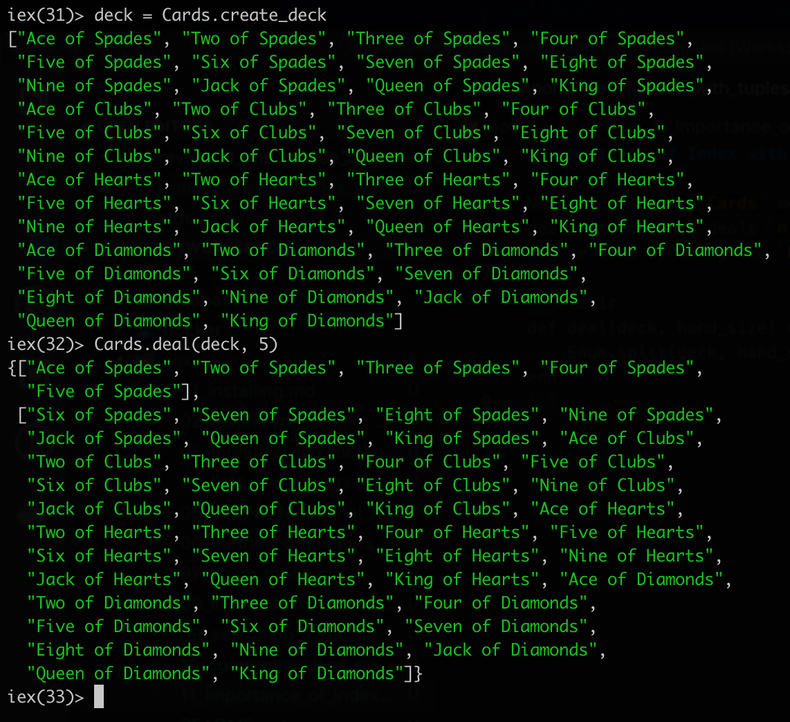

# Importance of Index with Tuples

Next step in the `Cards` module is to implement a deal method. That deals `n` cards from a deck. This can be done by using the `Enum.split` method.

```elixir
def deal(deck, hand_size) do
    Enum.split(deck, hand_size)
end
```



You can see that the output of the method is wrapped with `{}`, the first element is the cards dealt and the second list is the cards left.

The `{}` represents a data structure called a `tuple`. The hand is always at the index of `0`, the rest of the cards are at index `1`.

Essentially, a `list` is for a list of `similar records`, meanwhile the `tuple` is for stuff that can be in different types, but the `order has some specific meaning`.