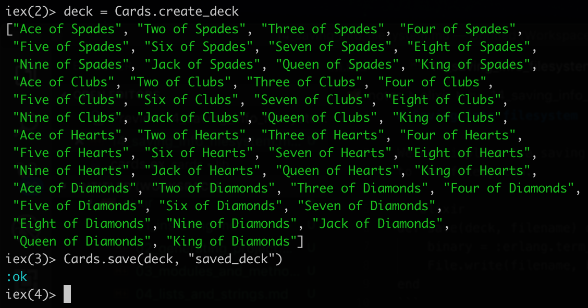
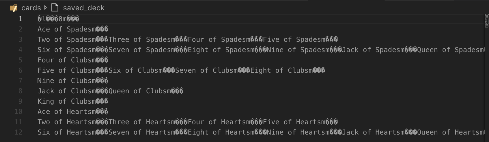

# Saving into filesystem

We can implement a saving method that saves the deck to the filesystem. 

```elixir
def save(deck, filename) do
    binary = :erlang.term_to_binary(deck)
    File.write(filename, binary)
end
```

The `:erlang` invokes an erlang method called `term_to_binary` which basically converts the `deck` into an object that can be written onto a filesystem.



It saves it onto the filesystem in a binary mode.

