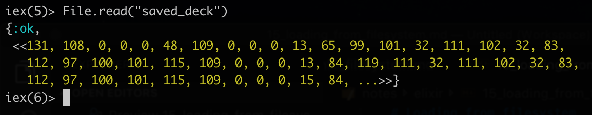
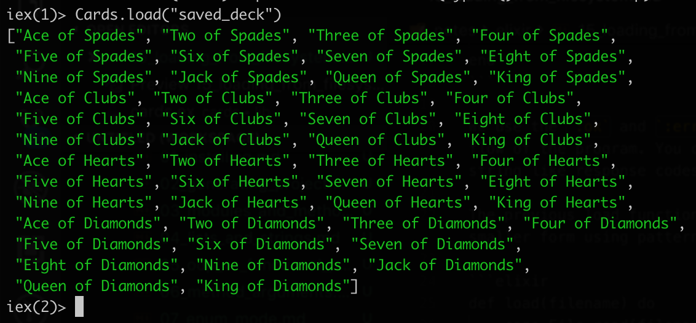

# Loading from filesystem

We can use `File.read` to read the file from the filesystem. It will return a tuple where the first element is `operation status` atom and the second is the `data`.



So we can use pattern matching and reverse the previously created save method.

```elixir
def load(filename) do
    {status, binary} = File.read(filename)

    case status do
        :ok -> :erlang.binary_to_term binary
        :error -> "That file does not exist"
    end
end
```

We use the `:ok` and `:error` atoms to control the flow of the program. You can consider the atoms as string like response codes.

The previous load function can be condensed into a smaller form using pattern matching.

```elixir
def load(filename) do
    case File.read(filename) do
        {:ok, binary} -> :erlang.binary_to_term binary
        {:error, _reason} -> "That file does not exist"
    end
end
```

We use the `_` symbol in the pattern matching to tell the compiler that we know that there is an element there, but we don't care about it. It will prevent the warning messages about unused variables.

