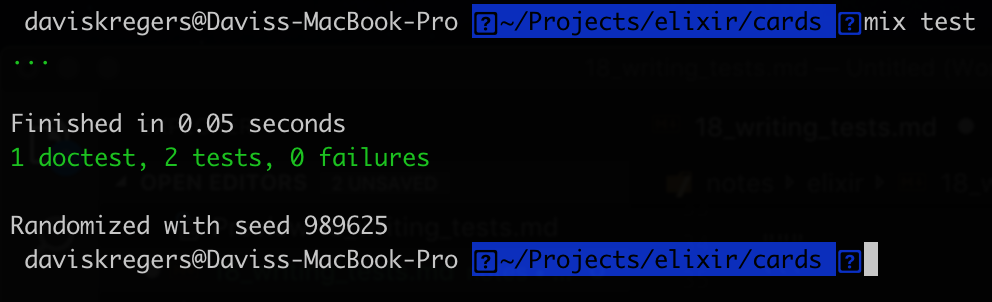

# Writing tests

Testing in elixir comes out of the box. You don't need additional packages to do it. The tests are located into the `test` directory.

There is a `test/cards_test.exs` file generated with the `cards` module.

The tests can be ran with the `mix test` command.

```elixir
defmodule CardsTest do
  use ExUnit.Case
  doctest Cards

  test "greets the world" do
    assert Cards.hello() == :world
  end
end
```

In elixir tests there are two distinct types of tests - `case tests` and `doctests`. The `unit tests` are written in the `test/cards_test.exs`, meanwhile `doctests` are written in the `lib/cards.ex` in the `@doc` section.

```elixir
@doc """
    Divides a deck into a hand and the remainder of the deck.
    The `hand_size` argument indicates how many cards should be in the hand.

## Examples

      iex> deck = Cards.create_deck
      iex> {hand,_deck}   = Cards.deal(deck,1)
      iex> hand
      ["Ace of Spades"]

"""
```

The `doctests` use the `Examples` section. 
Writing the `doctest` must follow the exact syntax:

- Starts with the `## Examples`
- The examples must be indented with 3 tabs (6 spaces)
- The commands to be executed starts with `iex>`, the ones without are assertions.
- There must be `doctest Cards` in the `test/cards_test.exs` file.

In `Case Tests` you can use `refute` to invert the `assert` operation:

```elixir
test "shuffling a deck randomizes it" do
    deck = Cards.create_deck
    refute deck == Cards.shuffle(deck)
    assert deck != Cards.shuffle(deck)
end
```

