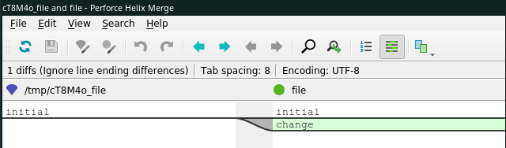
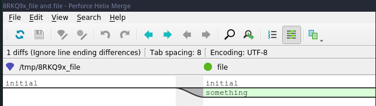

# Comparing working directory and staging area

```
 master  git status
On branch master
nothing to commit, working tree clean
  master  echo "initial" >> file
  master  git add file
  master ✚  git status
On branch master
Changes to be committed:
  (use "git reset HEAD <file>..." to unstage)

	new file:   file

  master ✚  echo "change" >> file
  master ●✚  git status
On branch master
Changes to be committed:
  (use "git reset HEAD <file>..." to unstage)

	new file:   file

Changes not staged for commit:
  (use "git add <file>..." to update what will be committed)
  (use "git checkout -- <file>..." to discard changes in working directory)

	modified:   file

```

```
git diff
```

```
diff --git a/file b/file
index e79c5e8..8ea0713 100644
--- a/file
+++ b/file
@@ -1 +1,2 @@
 initial
+change
```

```
git difftool
```



# Comparing working directory and Repository (last commit)

```
  master  git status       
On branch master
nothing to commit, working tree clean
  master  echo "initial" >> file
  master  git add file
  master ✚  git commit -m "add file"
[master 84f00a8] add file
 1 file changed, 1 insertion(+)
 create mode 100644 file
  master  echo "something" >> file
 master ●  git status
On branch master
Changes not staged for commit:
  (use "git add <file>..." to update what will be committed)
  (use "git checkout -- <file>..." to discard changes in working directory)

	modified:   file

no changes added to commit (use "git add" and/or "git commit -a")

```

```
git diff HEAD
```

```
diff --git a/file b/file
index e79c5e8..0339ca8 100644
--- a/file
+++ b/file
@@ -1 +1,2 @@
 initial
+something
```

```
git difftool HEAD
```



# Compare between staging and repository (last commit)

```
 master ●  git status
On branch master
Changes not staged for commit:
  (use "git add <file>..." to update what will be committed)
  (use "git checkout -- <file>..." to discard changes in working directory)

	modified:   file

no changes added to commit (use "git add" and/or "git commit -a")
  master ●  git add file
  master ✚  git status
On branch master
Changes to be committed:
  (use "git reset HEAD <file>..." to unstage)

	modified:   file
```

```
git diff --head HEAD
```

```
diff --git a/file b/file
index e79c5e8..0339ca8 100644
--- a/file
+++ b/file
@@ -1 +1,2 @@
 initial
+something
```

```
git diftool --staged HEAD
```


# Limiting comparison to one file

```
  master ●✚  git status
On branch master
Changes to be committed:
  (use "git reset HEAD <file>..." to unstage)

	modified:   file
	new file:   something else

Changes not staged for commit:
  (use "git add/rm <file>..." to update what will be committed)
  (use "git checkout -- <file>..." to discard changes in working directory)

	modified:   file
	deleted:    something else

Untracked files:
  (use "git add <file>..." to include in what will be committed)

	file2
	file3
```

```
git diff -- file
```

```
diff --git a/file b/file
index 0339ca8..762bbcd 100644
--- a/file
+++ b/file
@@ -1,2 +1,3 @@
 initial
 something
+asdf
```

```
git diftool -- file
```

# Comparing between commits

```
git log --oneline
```

```
84f00a8 (HEAD -> master) add file
4e4ddba remove file
e980c5c Add file
aa6daef moved file
a6a2066 Yello
a635aaf initial
```

```
git diff 4e4ddba HEAD
```

```
diff --git a/file b/file
new file mode 100644
index 0000000..e79c5e8
--- /dev/null
+++ b/file
@@ -0,0 +1 @@
+initial
```

```
git diff aa6daef e980c5c
```

```
diff --git a/file b/file
new file mode 100644
index 0000000..8ea0713
--- /dev/null
+++ b/file
@@ -0,0 +1,2 @@
+initial
+change
```

# Compare between local and remote master branch

```
git diff master origin/master
```