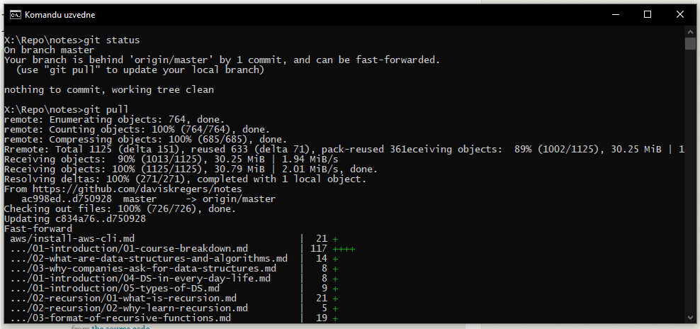
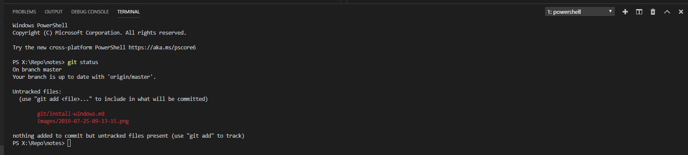

# Installing on windows

You can go to [https://git-scm.com/download/win](https://git-scm.com/download/win) and download the git installer. It will take you through the steps on installing it.

Once that's done, you can open command prompt (cmd) and use git commands.

If using vscode, the git commands should start working after restarting the application.

