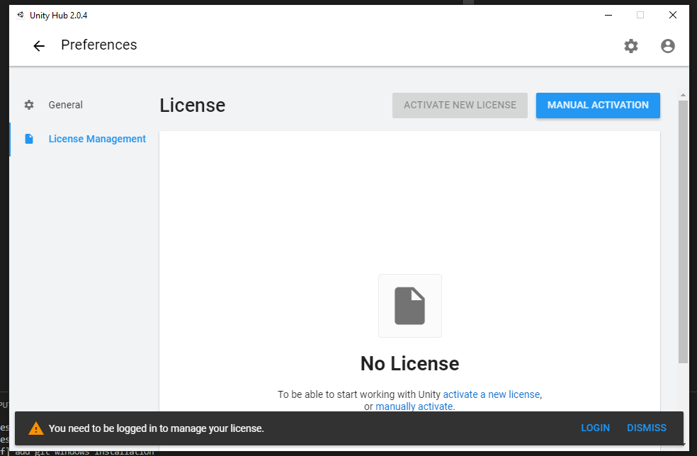
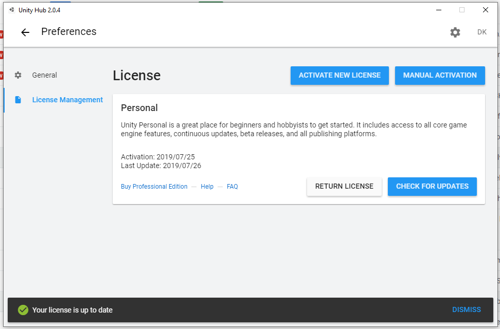
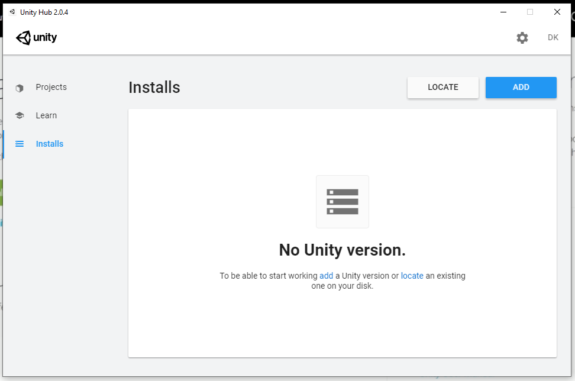
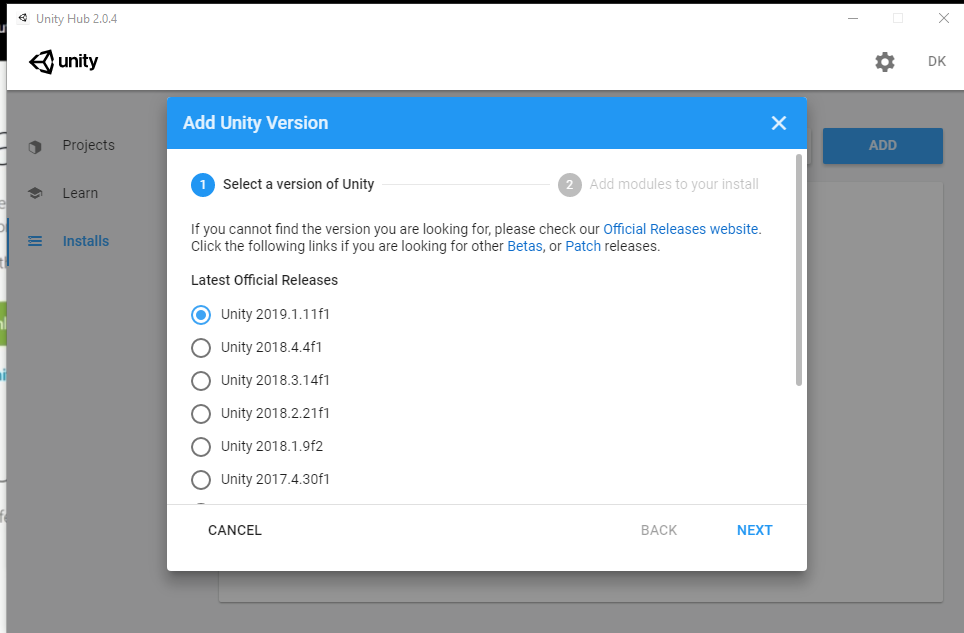
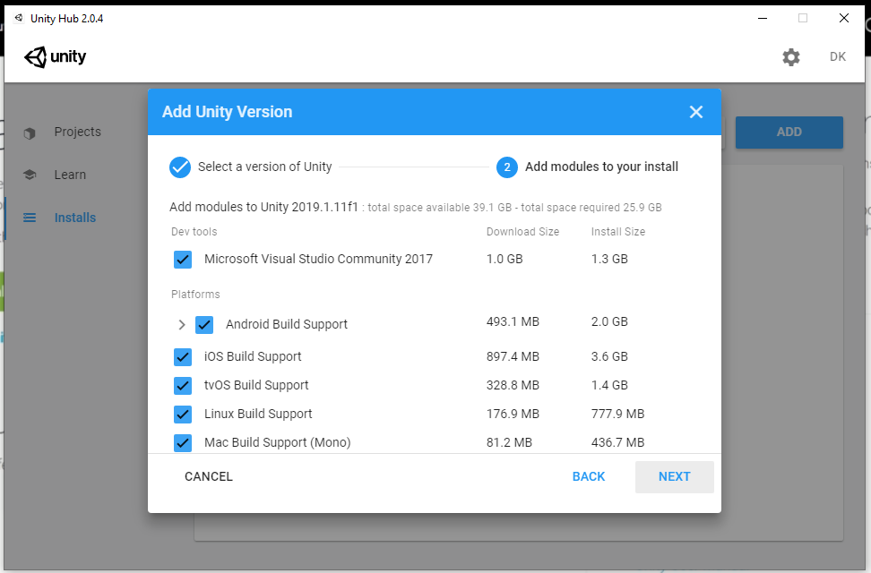

# Download Unity and Visual Studio

You can go to [https://unity3d.com/get-unity/download](https://unity3d.com/get-unity/download) and download the unity. Choose the `Unity Hub` version.

Once downloaded and installed, it will prompt for a license.

In order to obtain it, log in or create an account with unity. Once logged in, the `Activate new license` button will be clickable and you will be able to obtain a license:

Now you can click on the the top left arrow icon to go to the start, and go to the `Installs` tab. There will be a list of all unity versions installed.

We can click on add button and choose the version and the additional features we want. Make sure to select the `Visual Studio` option.

Then it will start downloading and installing unity.