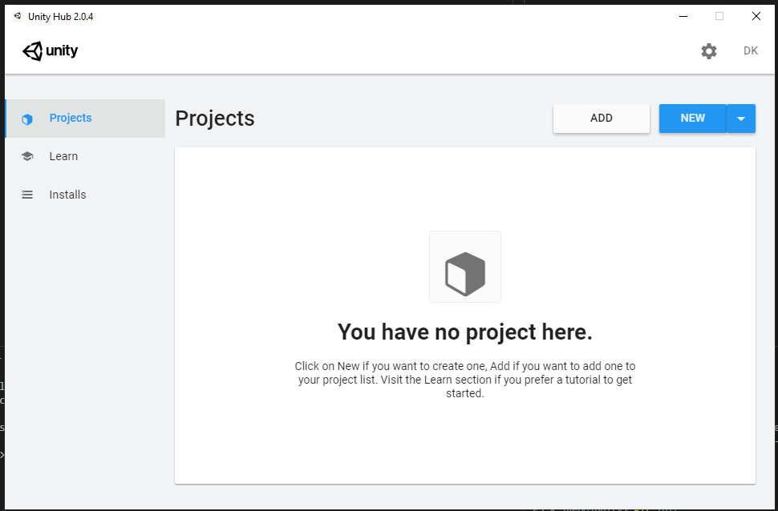
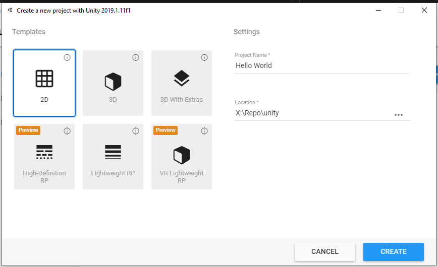
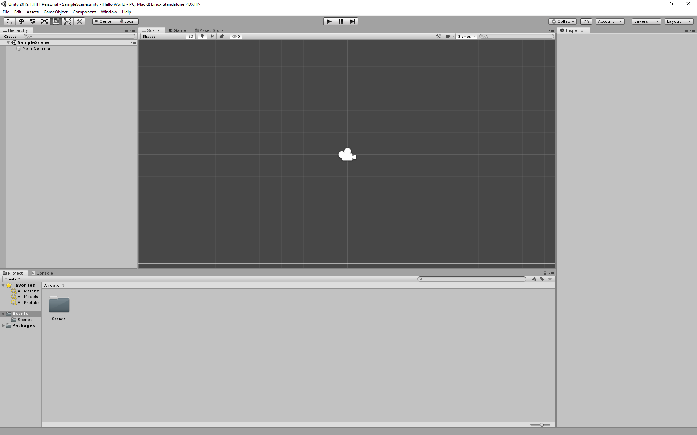
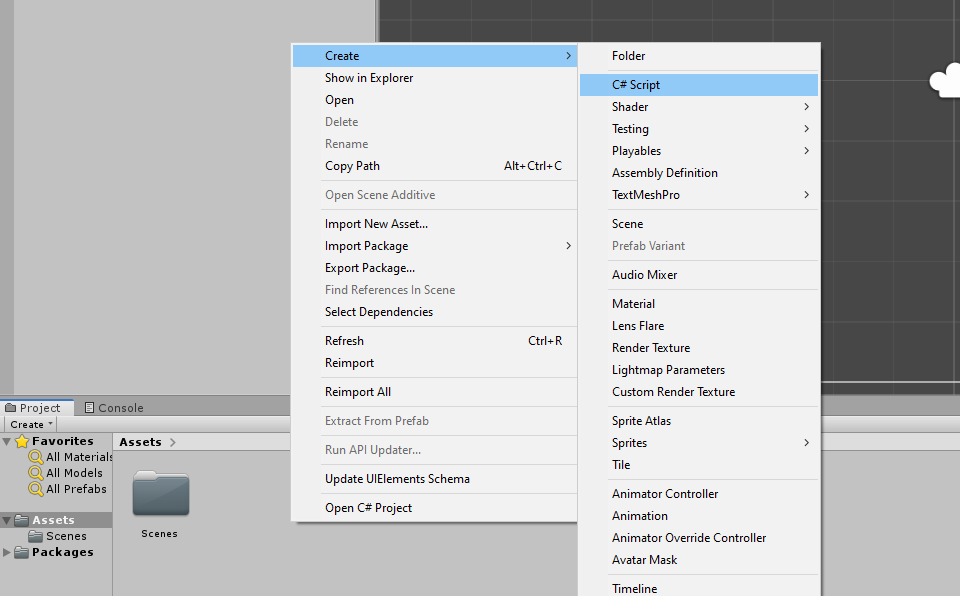
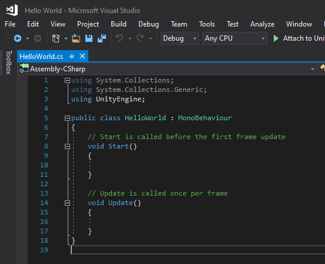
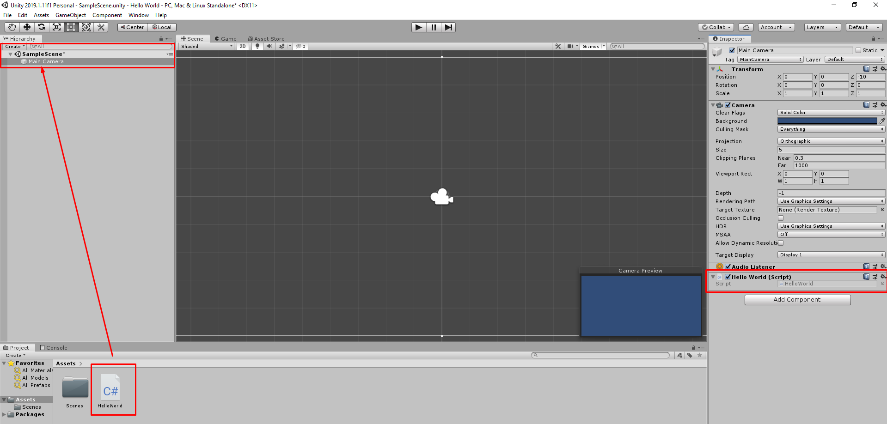
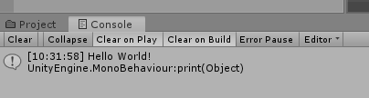

# Your first code

In this section we are going to make a Hello World application in [[Unity]] to check that everything is set up properly.

## How Unity and Visual Studio Relate

The unity is the game engine that describes what everything is and how it goes together. All the code that does this is being written in [[Visual Studio]], which is an [[IDE]]. 

## Setup

We can go to `Projects` tab in [[unity]].



And create a new project with a 2D template.



Once that's done, you will have a unity project opened.



Now in the assets area, create a new [[C# script]], name it HelloWorld.



Now, when you double click on the script, it will open up [[Visual Studio]].



Now we can modify the script:

```csharp
using System.Collections;
using System.Collections.Generic;
using UnityEngine;

public class HelloWorld : MonoBehaviour
{
    // Start is called before the first frame update
    void Start()
    {
        print("Hello World!");
    }

    // Update is called once per frame
    void Update()
    {
        
    }
}
```

Now we need to attach the script to an object, we can add it to the [[Main Camera object]], we have. Simply drag the script over it.



Now when we open up console and click on the `Play` button, the `Hello World` script executes.

