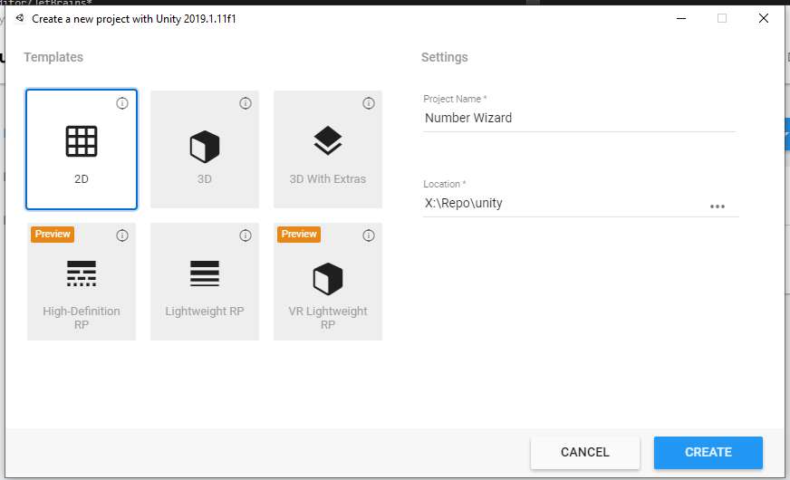
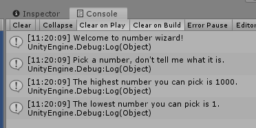

# Print To Console With Debug.Log

We'll make a new project.



We are going to create a new C# script now and call it `NumberWizard`, open it up in Visual Studio.

```csharp
using System.Collections;
using System.Collections.Generic;
using UnityEngine;

public class NumberWizard : MonoBehaviour
{
    // Start is called before the first frame update
    void Start()
    {
        Debug.Log("Welcome to number wizard!");
        Debug.Log("Pick a number, don't tell me what it is.");
        Debug.Log("The highest number you can pick is 1000.");
        Debug.Log("The lowest number you can pick is 1.");
    }

    // Update is called once per frame
    void Update()
    {
        
    }
}
```

Now add the script to the camera and run it.

