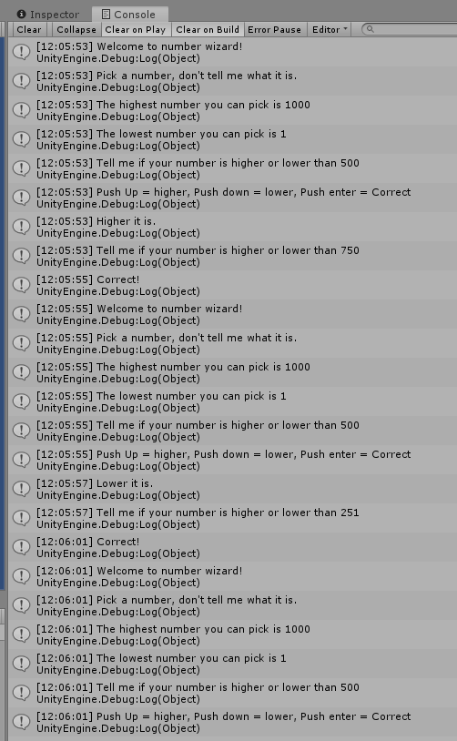

# Functions and encapsulating

Now we are going to make so that the game can reset once it's finished. Also, some code refactor.

```csharp

using System.Collections;
using System.Collections.Generic;
using UnityEngine;

public class NumberWizard : MonoBehaviour
{
    int min = 1;
    int max = 1000;
    int guess = 500;

    // Start is called before the first frame update
    void Start()
    {
        StartGame();
    }

    void StartGame()
    {

        max = 1000;
        min = 1;
        guess = 500;

        Debug.Log("Welcome to number wizard!");
        Debug.Log("Pick a number, don't tell me what it is.");
        Debug.Log("The highest number you can pick is " + max);
        Debug.Log("The lowest number you can pick is " + min);

        Debug.Log("Tell me if your number is higher or lower than " + guess);
        Debug.Log("Push Up = higher, Push down = lower, Push enter = Correct");

        guess++;

    }

    // Update is called once per frame
    void Update()
    {

        if ( Input.GetKeyDown(KeyCode.UpArrow) ) {
            min = guess;
            Debug.Log("Higher it is.");
            NextGuess();
        } else if (Input.GetKeyDown(KeyCode.DownArrow)) {
            max = guess;
            Debug.Log("Lower it is.");
            NextGuess();
        } else if (Input.GetKeyDown(KeyCode.Return)) {
            Debug.Log("Correct!");
            StartGame();
        }

    }

    void NextGuess()
    {
        guess = (min + max) / 2;
        Debug.Log("Tell me if your number is higher or lower than " + guess);
    }
}

```

