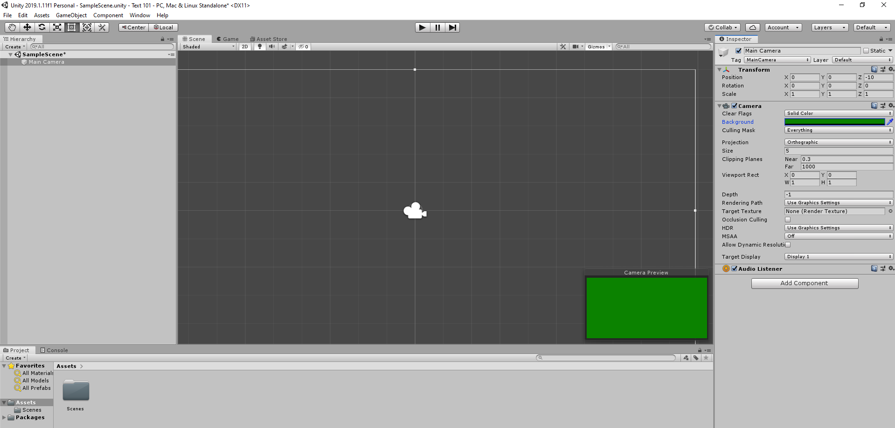
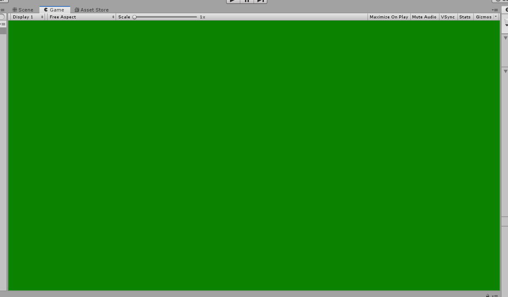
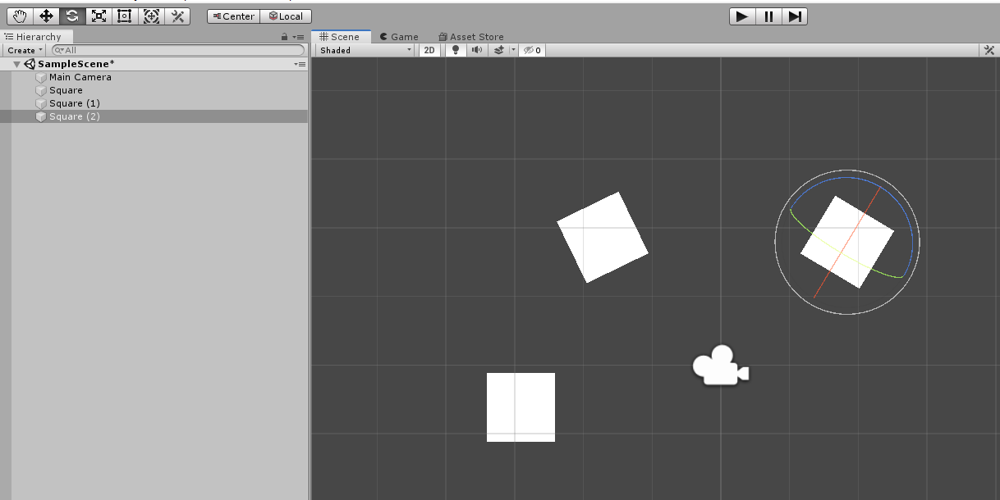
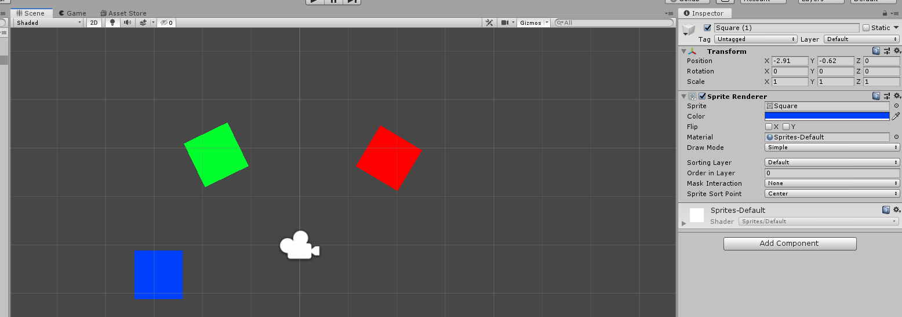
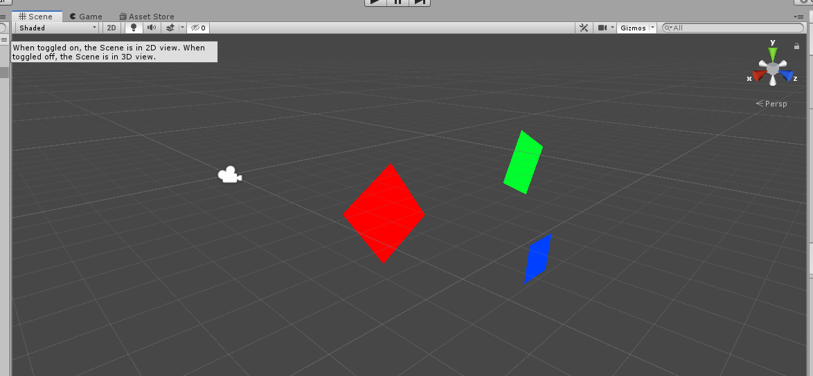

# Creating sprites in Unity

    A Sprite is a 2D graphic object obtained from a bitmap image.
    We can move, scale, rotate and do other transformations to it.

On the default layout, we have following windows:
- Hierarchy window
- Scene window
- Game window
- Project window
- Inspector window

To better get to know them, we can add a couple of sprites to the scene.

First of all, within the scene window, we can scroll in and out by using the scrollwheel or while holding ALT and right mouse button and dragging left/right.

When we click on the camera icon in the scene, we'll see that it will be selected in the hierarchy window, also will shot it's properties in inspector window. The camera is called a Game Object.

The `Camera Preview` shows what we would actually see if we would play the game, we also can click on the `Game Window` to see that.

We can change several options in the Inspector window, like background color of the camera.

When going to `Assets` directory in the `Project window`, we can right click and go to `Create -> Sprites -> Square`. Now, by dragging it into either hierarchy window or scene window, we will create an instance of it.

Then we can use the toolbar to select tools and transform them.

We can also change their properties in the `Inspector window`.

We can also toggle between 2D and 3D environments, by using the button under the `Scene window` tab.

