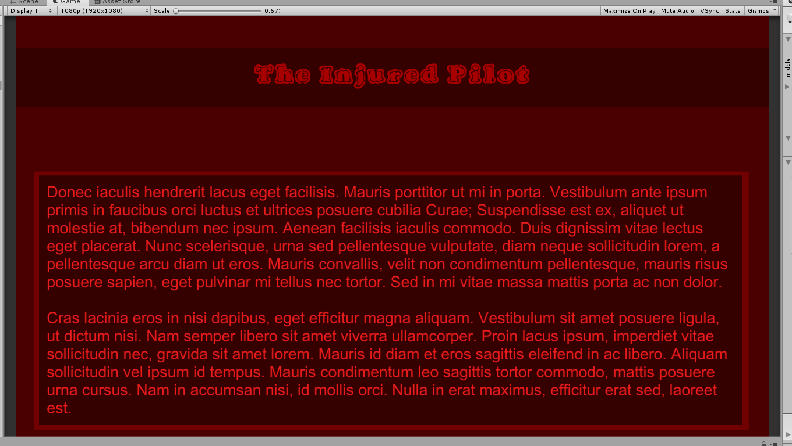

# Text Mest Pro and Polish

We can go to `Window -> TextMesh Pro -> Font Asset Creator`.  Import both options.

We can go to [https://www.dafont.com/vtc-fuzzy-punky-slippers.font](https://www.dafont.com/vtc-fuzzy-punky-slippers.font). Download it and extract. Drag it into Unity assets.

Drag it into the `Font Source` in `TextMesh Pro` and click on `Generate Font Atlas`. Save it.

Then create a new UI GameObject - `TextMeshPro - Text` and create a replacement title for the old one, pick the downloaded font. Change colors and stuff.

