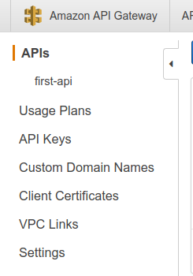

# General API Gateway features

There are multiple features in the `API Gateway`:

We previously looked at the `APIs section` where you can define your APIs and their endpoints.

There are other features as well like:
- `Usage Plans` - you can create plans on limiting gateway access for throttling or quotas.
- `API Keys` - for limiting access to API
- `Custom Domain names` - for giving your own domain name for the API
- `Client Certificates` - used to prove ownership of the api
- `Settings` - manage roles and permissions service has

