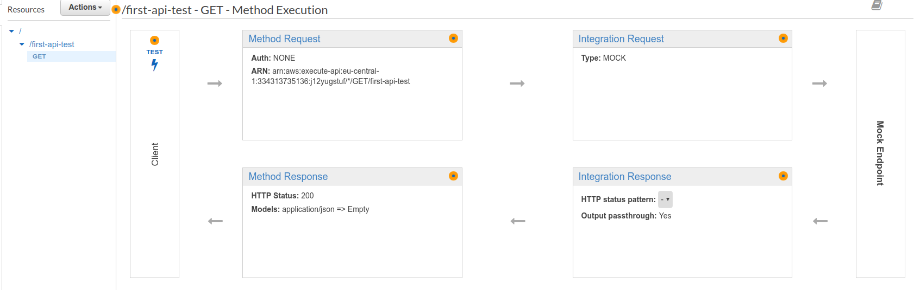
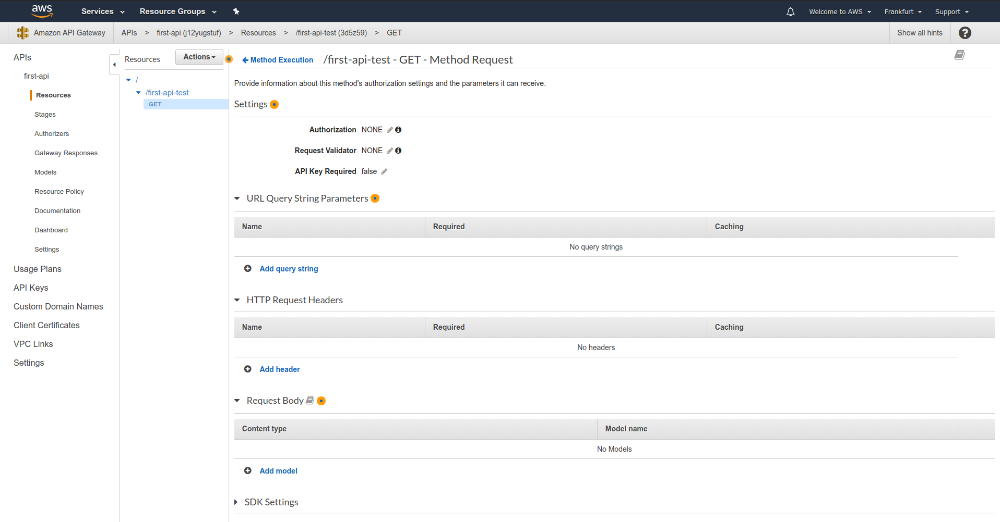
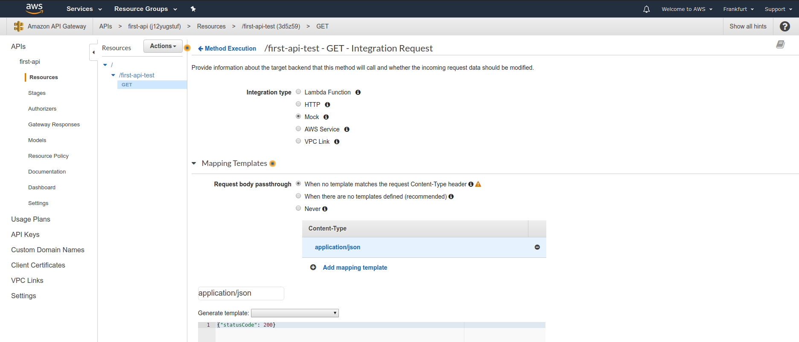
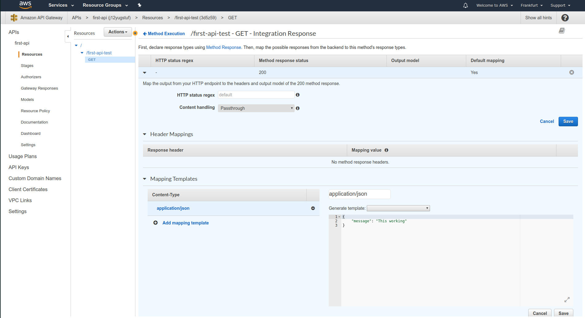
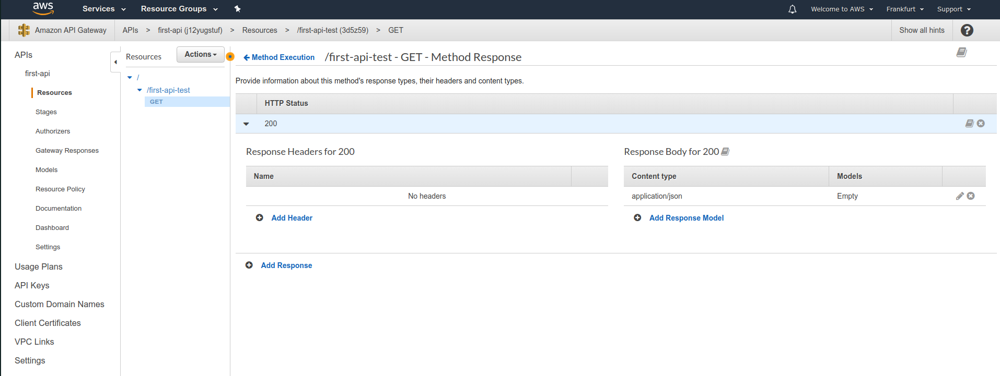

# Request-Response cycle

When we previously created an endpoint, we saw this flowchart. It is represents the `request-response cycle`.

We have a client that sends the request. 

## Method request

The `Method Request` depicts on how the request should actually look like. When clicking on it, we can modify multiple parameters like setting up authorization, add validation for query string, headers, body for fitting some schema. We can also require API key.

## Integration request

In previous step on the cycle, we transformed data we want to use. Now we are going to trigger action we want to do with that data.

Here we provide integration type - action type that will be triggered, as well ass the data we are going to extract from the request and pass it to the action.

## Integration reponse

Allows us to configure what response we are going to send back.

## Method response

Defines the shape of our response - which status codes, models and headers we are sending back.

